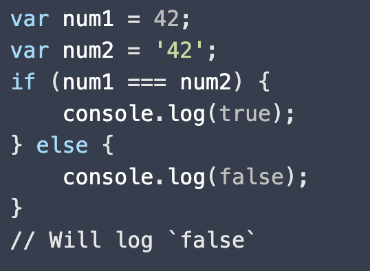
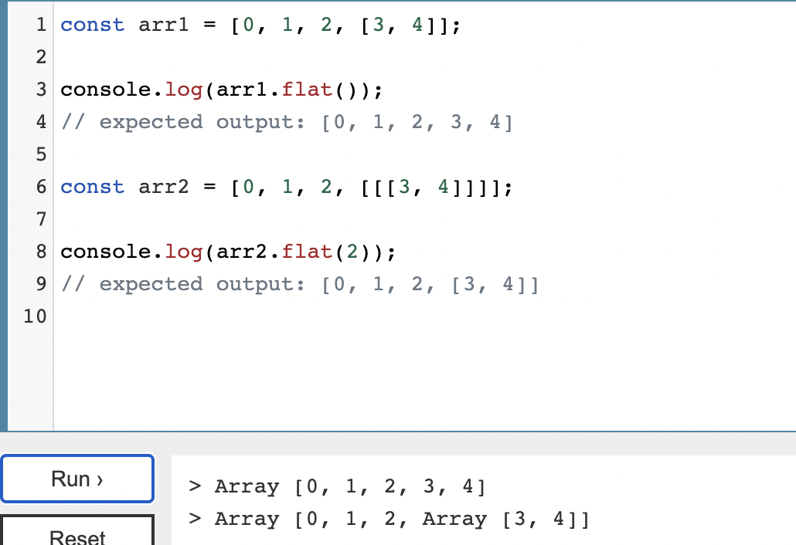
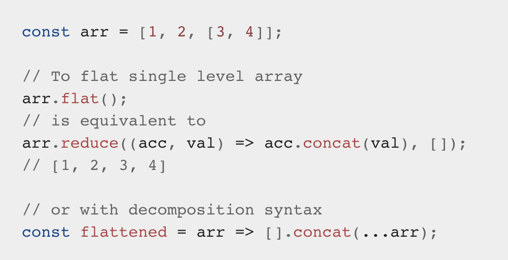
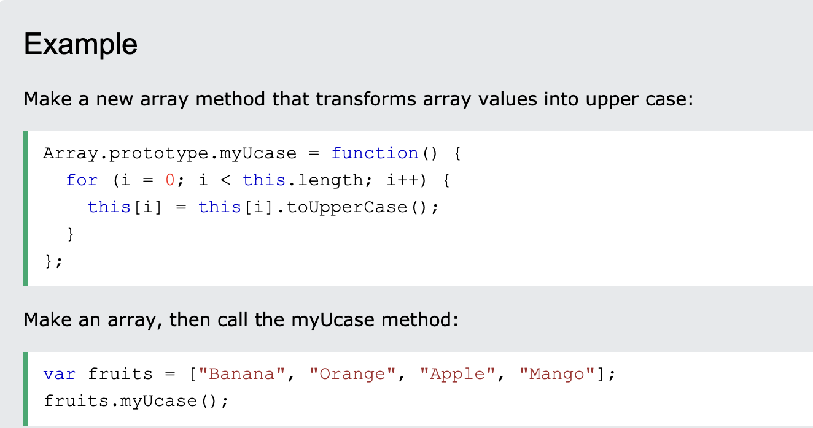
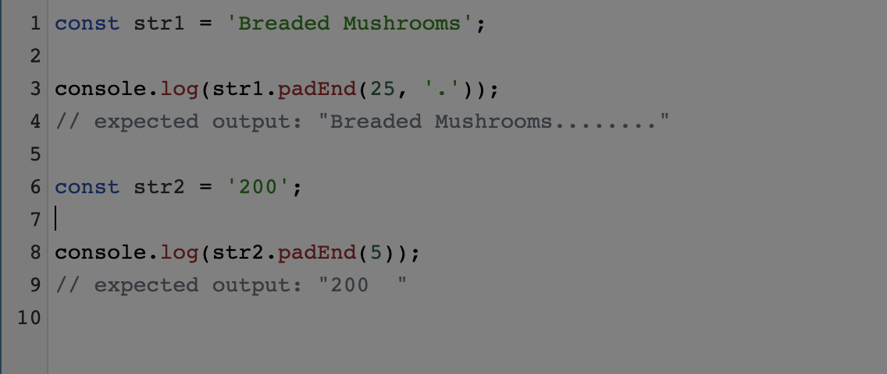
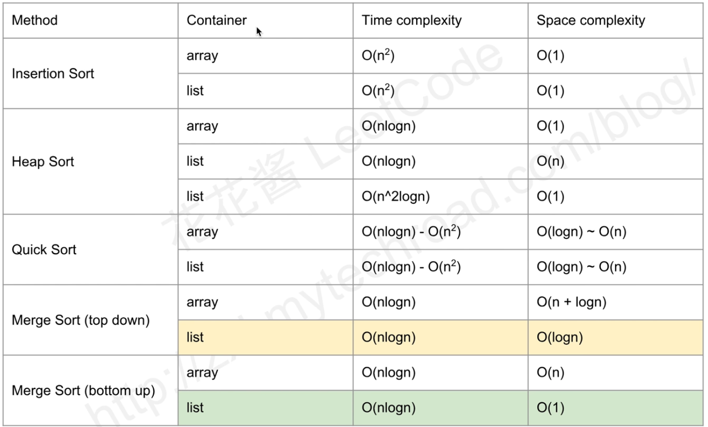
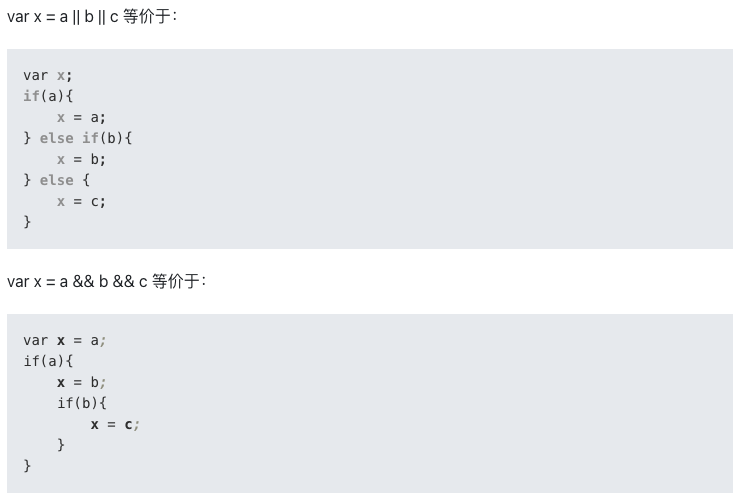
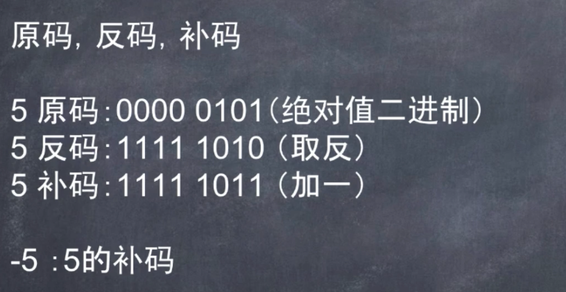
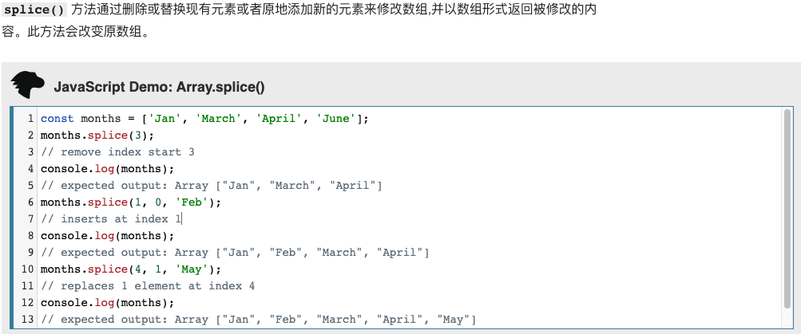
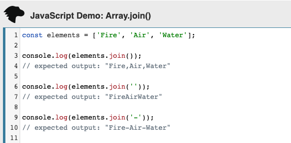

# Leetcode刷题笔记 Tips

## 1. Complete binary tree

定义: Every level, except possibly the last, is completely filled in a complete binary tree, and all nodes in the last level are as far left as possible.

## 2. Time & Space Complexity of Array.sort in V8

215. Kth Largest Element in an Array

V8 is Google's JavaScript engine. So the V8 engine uses Insertion Sort for super short arrays and Quick Sort for longer arrays. Interesting.

**QuickSort => Time: O(nlog(n)).Space: O(log(n)).**

**InsertionSort(default) => Time : O(n^2). Space: O(1)**
es the usual nested for loop so its time complexity is O(n^2) and its space complexity is O(1) because it sorts the array in place.

## 3. Converting strings to numbers with vanilla JavaScript

https://gomakethings.com/converting-strings-to-numbers-with-vanilla-javascript/

leetcode: 246

```javascript
var isStrobogrammatic = function(num) {
    let map = new Map();
    map.set(6,9);
    map.set(9,6);
    map.set(0,0);
    map.set(1,1);
    map.set(8,8);

    let left = 0;
    let right = num.length - 1;
    while (left <= right) {
        // 特别要注意这里。 转化 string => number
        if (!map.has(Number(num[left]))) {
            return false;
        }
        if (map.get(Number(num[left])) != Number(num[right])) {
            return false;
        }
        left++;
        right--;
    }
    return true;
}
```

## 4.天坑 => Create 2D Array

### Declare an empty two-dimensional array in Javascript

### 这两种定义2D array的方式.第二种是错误的。

### fill: Value to fill the array with. (Note all elements in the array will be this exact value.)

```javascript
// const dp = Array.from({length: R_NUM+1}, () => Array(C_NUM+1).fill(0));  // 正确🙆
// const dp = [...Array(R_NUM+1)].map(x=>Array(C_NUM+1).fill(0))  // 正确🙆


// Array(R_NUM+1) 里面的东西都是一样的 
let dp = new Array(R_NUM+1).fill(new Array(C_NUM+1).fill(0)); // 错❌
```

```javascript
for (var i = 0; i < 3; i++) {
    x.push(new Array(2).fill(0));
}
console.log(x);
// [ [ 0, 0 ], [ 0, 0 ], [ 0, 0 ] ]
```
## 5. GetKey from value

```javascript
const map = new Map([
  [1, 'one'],
  [2, 'two'],
  [3, 'three'],
]);

function getKey(val) {
  return [...map].find(([key, value]) => val === value)[0];
}

console.log(getKey('one'));   // 1
console.log(getKey('two'));   // 2
console.log(getKey('three')); // 3
```

## 6. ES6: 查看map是否包含value: b

```javascript
[...map.values()].includes(b)
```

## 7. Cloning an array

```javascript
// (ES6) - [...tempList]
// (ES5) - JSON.parse(JSON.stringify(tempList)) ;
```

## 8. Array.prototype.flat()

The flat() method creates a new array with all sub-array elements concatenated into it recursively up to the specified depth

这里depth可以选的，line: 8 => flat(2) => 所以去掉两层。

方法一：


方法二：


方法三：
```javascript

function flattenMultiArray(arr) {
 const flattened = [].concat(...arr);
 return flattened.some(item => Array.isArray(item)) ? flattenMultiArray(flattened) : flattened;
}
const multiDimensionalArr = [11, [22, 33], [44, [55, 66, [77, [88]], 99]]];
const flatArr = flattenMultiArray(multiDimensionalArr); // [11, 22, 33, 44, 55, 66, 77, 88, 99]

```

## 9. Array.prototype.flatMap()

flatMap()方法首先使用映射函数映射每个元素，然后将结果压缩成一个新数组。

它与map连着深度值为1的flat几乎相同，但flatMap通常在合并成一种方法的效率稍微高一些。

```javascript
var kthSmallest = function (matrix, k) {
    return matrix.flatMap(x => x).sort((a, b) => a - b)[k - 1];
    // return matrix.flat().sort((a, b) => a - b)[k - 1]
};
```

```javascript
var arr = [1, 2, 3, 4];

arr.flatMap(x => [x, x * 2]);
// is equivalent to

arr.reduce((acc, x) => acc.concat([x, x * 2]), []);
// [1, 2, 2, 4, 3, 6, 4, 8]
```

```javascript
let arr1 = ["it's Sunny in", "", "California"];

arr1.map(x => x.split(" "));
// [["it's","Sunny","in"],[""],["California"]]

arr1.flatMap(x => x.split(" "));
// ["it's","Sunny","in", "", "California"]
```

## 10. map()and flatMap()
```javascript
let arr1 = [1, 2, 3, 4];

arr1.map(x => [x * 2]);
// [[2], [4], [6], [8]]

arr1.flatMap(x => [x * 2]);
// [2, 4, 6, 8]

// only one level is flattened
arr1.flatMap(x => [[x * 2]]);
// [[2], [4], [6], [8]]
```

## 11. Template literals (Template strings)
```javascript
let a = 1;
let b = 9;

let res = typeof(`${b}${a}`) // string
```

## 12. Array.prototype.sort()
sort()方法用原地算法对数组的元素进行排序，并返回数组。

默认排序顺序是在将元素转换为字符串，然后比较它们的UTF-16代码单元值序列时构建的。

所以一旦有负数的时候就要重新写这个比较的函数。 如下：

```javascript
nums = nums.sort((a, b) => a - b); // 从小到达
nums = nums.sort((a, b) => b - a); // 从大到小
```

## 13. JavaScript Array prototype Constructor


## 14. String.prototype.charCodeAt()

1). The **charCodeAt()** method returns an integer between 0 and 65535 representing the UTF-16 code unit at the given index.

```javascript
// The following example returns 65, the Unicode value for A.

'ABC'.charCodeAt(0)  // returns 65
```

2). The static **String.fromCharCode()** method returns a string created from the specified sequence of UTF-16 code units.

```javascript
String.fromCharCode(65, 66, 67);   // returns "ABC"
```

Example:
https://leetcode.com/problems/excel-sheet-column-title/

```javascript
String.fromCharCode(('A'.charCodeAt(0) + columnNumber % 26)) //  =》 A,B,C,D
```

## 15. String.prototype.padEnd()

The padEnd() method pads the current string with a given string (repeated, if needed) so that the resulting string reaches a given length. 

The padding is applied from the end of the current string.



## 16. Remove all non-alphanumeric characters element
```javascript
s = s.replace(/[^a-zA-Z0-9]/g, '').toLowerCase();
```

## 17. Generate a sequence of numbers

```javascript
// Generate a sequence of numbers
// Array.from(arrayLike, (element, index) => { ... } )
Array.from({length: 5}, (v, i) => i);
// [0, 1, 2, 3, 4]

// Sequence generator function 
const range = (start, stop, step) => Array.from({ length: (stop - start) / step + 1}, (_, i) => start + (i * step));

// Generate numbers range 0..4
range(0, 4, 1);
// [0, 1, 2, 3, 4]

// Generate numbers range 1..10 with step of 2
range(1, 10, 2);
// [1, 3, 5, 7, 9]
```

## 18. Array to set and set to array

```javascript
let set = new Set(nums);
let array = [...set];
```

## 19. Search



## 20. Array mimic Queue 

**1). Array.prototype.unshift()**

Adds one or more elements to the front of an array, and returns the new length of the array.

**2). Array.prototype.shift()**

Removes the first element from an array and returns that element.

## 21. Array mimic Stack 

**1). Array.prototype.pop()**

Removes the last element from an array and returns that element.

**2). Array.prototype.push()**

Adds one or more elements to the end of an array, and returns the new length of the array.

## 22. 二分发的问题: Integer Math.floor() vs Math.round() vs Math.ceil() difference;
**let mid = start + Math.floor((hith-low)/2)**

**1). Math.floor()**

Math.floor()是向下取整，Math.ceil()是向上取整

如果是正整数还行 8.999 => 8，要是负数，-0.3 => -1

所以就要用Math.round()。 只取整数位的数字。

**2). Math.round()**
Math.round()是四舍五入进行取整

function returns the value of a number rounded to the nearest integer.

```javascript
Math.round( 20.49); //  20
Math.round( 20.5 ); //  21
Math.round( 42   ); //  42
Math.round(-20.5 ); // -20
Math.round(-20.51); // -21
```

**3). 使用es6中的Math.trunc()方法进行取整**

Math.trunc()是es6中新增的方法，方法会将数字的小数部分去掉，只保留整数部分。

返回给定的数值的整数部分。

不像 Math 的其他三个方法： Math.floor()、Math.ceil()、Math.round() ，Math.trunc() 的执行逻辑很简单，仅仅是删除掉数字的小数部分和小数点，不管参数是正数还是负数。

```javascript
Math.trunc(13.37)    // 13
Math.trunc(42.84)    // 42
Math.trunc(0.123)    //  0
Math.trunc(-0.123)   // -0
Math.trunc("-1.123") // -1
Math.trunc(NaN)      // NaN
Math.trunc("foo")    // NaN
Math.trunc()         // NaN
```

## 23. Three Ways to Reverse a String in JavaScript

https://www.freecodecamp.org/news/how-to-reverse-a-string-in-javascript-in-3-different-ways-75e4763c68cb/

```javascript
function reverseString(str) {
    return str.split("").reverse().join("");
}
reverseString("hello");
```
## 24. operator && and || 重要用法



重要的用法！！！

```javascript
let obj = {
    'a': 1
}

let res = obj.a + 1 || 1;
console.log(res); // 2

let res1 = obj.b + 1 || 1;
console.log(res1); // 1
```

## 25. How to Iterate Through Strings in JavaScript
**1). for of**
```javascript
const str = 'banana';

for (let c of str) {
  process(c)
}
```

**2). for loop**
```javascript
const str = 'banana';

// bracket notation
for (let i = 0; i < str.length; i++) {
  process(str[i]);
}

// charAt()
for (let i = 0; i < str.length; i++) {
  process(str.charAt(i));
}
```
## 26. Converting strings to numbers with vanilla JavaScript

In JavaScript, you can represent a number is an actual number (ex. 42), or as a string (ex. '42').

If you were to use a strict comparison to compare the two, it would fail because they’re two different types of objects.

```javascript
var num1 = 42;
var num2 = '42';
if (num1 === num2) {
    console.log(true);
} else {
    console.log(false);
}
// Will log `false`
```

**1). parseInt()**
.parseInt() takes a String as a first argument, and a base to which that String will be converted to. This method always returns an integer.

```javascript
var text = '42px';
var integer = parseInt(text, 10);
// returns 42
```

**2). parseFloat()**
.parseFloat() takes a String as an argument, and returns the Float point number equivalent.

```javascript
var text = '3.14someRandomStuff';
var pointNum = parseFloat(text);
// returns 3.14
```

**3). Number()**

```javascript
// Convert strings
Number('123'); // returns 123
Number('12.3'); // returns 12.3
Number('3.14someRandomStuff'); // returns NaN
Number('42px'); // returns NaN
```

**4). Unary Operator By adding a + sign before a String**

It will be converted into a number if it follows the right format.

**5). Multiply by 1**

If a String is multiplied by the primitive number 1, the string will become a number.

## 27. 5 ways to check if an array contains a value in JavaScript

**1). indexOf() Method**

```javascript
const fruits = ['🍎', '🍋', '🍊', '🍇', '🍍', '🍐'];

fruits.indexOf('🍋'); // 1  (true)
fruits.indexOf('🍍'); // 4  (true)
fruits.indexOf('🍌'); // -1 (false)
```

**2). includes() Method**

```javascript
const fruits = ['🍎', '🍋', '🍊', '🍇', '🍍', '🍐'];

fruits.includes('🍇');  // true
fruits.includes('🍉');  // false
```

Both includes() and indexOf() behave differently with NaN ("Not-a-Number") property:
```javascript
const arr = [NaN];

// ✅
arr.includes(NaN) // true

// ❌
arr.indexOf(NaN)   // -1
```

**3). find() Method**

Unlike includes(), the find() method executes the specified function for each element present in the array. It returns the value of the first element in an array that passes a certain condition:

```javascript
const fruits = ['🍎', '🍋', '🍊', '🍇', '🍍', '🍐'];

const value = fruits.find(elem => elem === '🍍');

console.log(value); // 🍍
```

**4). lastIndexOf()**
```javascript
const animals = ['Dodo', 'Tiger', 'Penguin', 'Dodo'];

console.log(animals.lastIndexOf('Dodo'));
// expected output: 3

console.log(animals.lastIndexOf('Tiger'));
// expected output: 1

```

## 28. How to iterate a Map in Javascript  

```javascript
let myMap = new Map()
myMap.set(0, 'zero')
myMap.set(1, 'one')

for (let [key, value] of myMap) {
    console.log(key + ' = ' + value)
}
```

## 29. Bitwise


## 30. Array.prototype.splice()
months.splice(4, 0, 'May'); // => Array ["Jan", "Feb", "March", "April", "May", "June"]

// insert 1 element at index 4, 之后的元素会自动后移。



## 31. Expressions and operators

```javascript
'2' * 3
// output: 6
'2' - 4
// output:-2
'5' + 5
// output:"55"
'3' / 3
// output: 1

'2' > 2
// output: false
'12' > 2
// output: true
'2' == 2
// output: true
'1' < 5
// output: true
```

## 32. String.prototype.split() => string => array

The split() method divides a String into an ordered list of substrings, puts these substrings into an array, and returns the array. 

```javascript
const str = 'The quick brown fox jumps over the lazy dog.';

const words = str.split(' ');
console.log(words[3]);
// expected output: "fox"
```

## 33. Array.prototype.join() => array => string

The join() method creates and returns a new string by concatenating all of the elements in an array (or an array-like object), separated by commas or a specified separator string.




## 34. Object.keys, values, entries

https://javascript.info/keys-values-entries

For plain objects, the following methods are available:

- Object.keys(obj)– returns an array of keys.
  
- Object.values(obj)– returns an array of values.
  
- Object.entries(obj)– returns an array of [key, value] pairs.

## 35. What Is the Best Way to Check if an Array Is Empty or Not in JavaScript?

https://www.designcise.com/web/tutorial/what-is-the-best-way-to-check-if-an-array-is-empty-or-not-In-javascript#using-array-is-array-method


## 36. 展开语法

https://developer.mozilla.org/zh-CN/docs/Web/JavaScript/Reference/Operators/Spread_syntax
