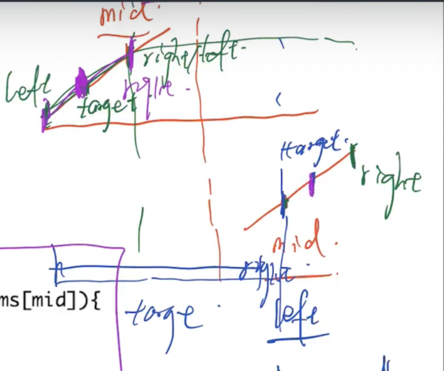
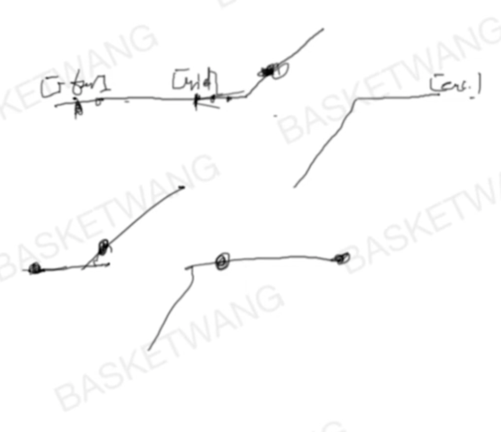

# Leetcode刷题笔记（排序和查找部分）


## S.Selection Sort
就是不断遍历，找到最小的，交换到最前面。

然后继续在剩下的部分里面找到最小的。继续交换。
Time: O(n^2) =》  1+2+4+...+n-1 = n(n-1)/2=n^2 
Space: O(1)

```javascript
var selectionSort = function(arr) {
    let temp, global;
    for (let i = 0; i < arr.length - 1; i++) {
        global = i;
        for (let j = i + 1; j < arr.length; j++) {
            if (arr[j] < arr[global]) {
                global = j;
            }
        }
        temp = arr[i];
        arr[i] = arr[global];
        arr[global] = temp;
    }
    return arr;
}

let arr = [11,2,4,8,];
console.log(selectionSort(arr))
```

## S.Merge Sort
讲解在这里：https://javascript.plainenglish.io/javascript-merge-sort-3205891ac060

```javascript
// Merge the two arrays: left and right
function merge (left, right) {
    let resultArray = [], leftIndex = 0, rightIndex = 0;

    // We will concatenate values into the resultArray in order
    while (leftIndex < left.length && rightIndex < right.length) {
        if (left[leftIndex] < right[rightIndex]) {
            resultArray.push(left[leftIndex]);
            leftIndex++; // move left array cursor
        } else {
            resultArray.push(right[rightIndex]);
            rightIndex++; // move right array cursor
        }
    }

    // We need to concat here because there will be one element remaining
    // from either left OR the right
    return resultArray
        .concat(left.slice(leftIndex))
        .concat(right.slice(rightIndex));
}

// Merge Sort Implentation (Recursion)
function mergeSort (unsortedArray) {
    // No need to sort the array if the array only has one element or empty
    if (unsortedArray.length <= 1) {
        return unsortedArray;
    }
    // In order to divide the array in half, we need to figure out the middle
    const middle = Math.floor(unsortedArray.length / 2);

    // This is where we will be dividing the array into left and right
    const left = unsortedArray.slice(0, middle);
    const right = unsortedArray.slice(middle);

    // Using recursion to combine the left and right
    return merge(
        mergeSort(left), mergeSort(right)
    );
}
```
## S.Quick Sort
这个就讲解的很到位了：https://www.guru99.com/quicksort-in-javascript.html

What is the reason to choose Quick sort over default sort() in JavaScript

Though sort() gives the result we want, problem lies with the way it sorts the array elements. 

Default sort() in JavaScript uses insertion sort by V8 Engine of Chrome and Merge sort by Mozilla Firefox and Safari.

But, other this is not suitable if you need to sort large number of elements. So, the solution is to use Quick sort for large dataset.

So, to understand completely, you need to know how Quick sort works and let us see that in detail now.

```javascript
var items = [5,3,7,6,2,9];
function swap(items, leftIndex, rightIndex){
    var temp = items[leftIndex];
    items[leftIndex] = items[rightIndex];
    items[rightIndex] = temp;
}
function partition(items, left, right) {
    var pivot   = items[Math.floor((right + left) / 2)], //middle element
        i       = left, //left pointer
        j       = right; //right pointer
    while (i <= j) {
        while (items[i] < pivot) {
            i++;
        }
        while (items[j] > pivot) {
            j--;
        }
        if (i <= j) {
            swap(items, i, j); //sawpping two elements
            i++;
            j--;
        }
    }
    return i;
}

function quickSort(items, left, right) {
    var index;
    if (items.length > 1) {
        index = partition(items, left, right); //index returned from partition
        if (left < index - 1) { //more elements on the left side of the pivot
            quickSort(items, left, index - 1);
        }
        if (index < right) { //more elements on the right side of the pivot
            quickSort(items, index, right);
        }
    }
    return items;
}
// first call to quick sort
var sortedArray = quickSort(items, 0, items.length - 1);
console.log(sortedArray); //prints [2,3,5,6,7,9]
```

## S.Rainbow Sort
```javascript
function swap(arr, left, right) {
    let temp = arr[left];
    arr[left] = arr[right];
    arr[right] = temp;
}


// right:  右边不包含右边，都是2
// left: 左边不包含左边，都是0
// index: 中间是1
var sortColors = function(nums) {
    let left  = 0;
    let right = nums.length - 1;
    let index = 0;
    while (index <= right) {
        if (nums[index] == 0) {
            swap(nums, index++, left++);
        } else if(nums[index] == 1) {
            index++;
        } else {
            swap(nums, index, right--);
        }
    }
};
```

## S.Insertion Sort

思想：

- 整个排序过程分成两个部分，前面一部分是有序的，后面一部分是无序的。最开始的时候，下标是0的位置是有序的，0之后的部分是需要进行排序的。换言之，0之后无序部分需要插入到前面的有序部分中。
- 每次到达一个位置后，先和其前面的一个位置比较，如果比前面的小，就和前面一个交换，然后继续和前面一个交换，直到不比前面一个元素小为止。
- https://medium.com/dailyjs/insertion-sort-in-javascript-9c077844717a
  
代码：

```javascript
const insertionSort = (nums) => {
  for (let i = 1; i < nums.length; i++) {
    let j = i - 1
    let tmp = nums[i]
    while (j >= 0 && nums[j] > tmp) {
      nums[j + 1] = nums[j]
      j--
    }
    nums[j+1] = tmp
  }
  return nums
}
```

分析：

最好情况：数组的初始状态是有序的，然后一共需要比较的次数是`n-1`，

最差情况，数组的初始状态是逆序的，此时，在比较次数上和选择排序是相同的，但是显然在交换次数上插入排序用的更多。比较次数是`O(N^2)`，交换次数是`O(N^2)`。


## S.88_Merge Sorted Array

原题地址：https://leetcode.com/problems/merge-sorted-array/

思路：

给定nums1和nums2两个数组，其中包含的元素分别是m和和n个。要求把nums2中的树放到num1中，并且让num1是有序的。num1的大小可以容纳下两个数组的所有元素。

知识一道easy的题目，因为不允许使用多余的数组空间，就不好对两个数组从前往后进行比较（插入位置比较麻烦）。方法是从后往前比，然后处理剩下的元素。

代码：

```javascript
var merge = function(nums1, m, nums2, n) {
    let i = m-1;
    let j = n-1;
    let k = m+n-1;
    while (i >= 0 && j >= 0) {
        nums1[k--] = nums1[i] >= nums2[i] ? nums1[i--] : nums2[j--]
    }
    while(j >= 0) {
        nums1[k--] = nums2[j--];
    }
};
```

## S.21_Merge Two Sorted Lists

原题地址：https://leetcode.com/problems/merge-two-sorted-lists/

思路: 因为是对有序的链表排序，就从头开始，分别比较两个链表的每个元素。较小元素放前面，然后一次往后走。

代码：

```javascript
function ListNode(val, next) {
    this.val = (val === undefined ? 0 : val)
    this.next = (next === undefined ? null : next)
}

var mergeTwoLists = function(l1, l2) {
    let dummy = new ListNode(0);
    let cur = dummy;
    while (l1 != null && l2 != null) {
        if (l1.val < l2.val) {
            cur.next = l1;
            cur = cur.next;
            l1 = l1.next;
        } else {
            cur.next = l2;
            cur = cur.next;
            l2 = l2.next;
        }
    }

    if (l1 != null) {
        cur.next = l1;
    }

    if (l2 != null) {
        cur.next = l2;
    }

    return dummy.next;
};
```

## S.147_Insertion Sort List
https://medium.com/dailyjs/insertion-sort-in-javascript-9c077844717a
原题地址：https://leetcode.com/problems/insertion-sort-list/

思路：

思路很简单，就是把一个一个元素往已排好序的list中插入的过程。

初始时，sorted list是空，把一个元素插入sorted list中。然后，在每一次插入过程中，都是找到最合适位置进行插入。

因为是链表的插入操作，需要维护pre，cur和next3个指针。

pre始终指向sorted list的fakehead，cur指向当前需要被插入的元素，next指向下一个需要被插入的元素。

当sortedlist为空以及pre.next所指向的元素比cur指向的元素值要大时，需要把cur元素插入到pre.next所指向元素之前。否则，pre指针后移。

最后返回fakehead的next即可。


代码：

```javascript
/**
 * 147. Insertion Sort List
 * time : O(n^2)
 * space : O(1)
 * @param {ListNode} head
 * @return {ListNode}
 */
function ListNode(val, next) {
    this.val = (val === undefined ? 0 : val)
    this.next = (next === undefined ? null : next)
}

var insertionSortList = function (head) {
    if (head == null || head.next == null) return head;
    let dummy = new ListNode(-1);
    dummy.next = head;
    let prev = null;
    let temp = null;
    let cur = head;
    while (cur != null && cur.next != null) {
        if (cur.val <= cur.next.val) {
            cur = cur.next;
        } else {
            prev = dummy;
            temp = cur.next;
            cur.next = temp.next;

            while (prev.next.val <= temp.val) {
                prev = prev.next;
            }
            temp.next = prev.next;
            prev.next = temp;
        }
    }
    return dummy.next;
};
```

## S.148_Sort List

原题地址：https://leetcode.com/problems/sort-list/

思路： 对这个LinkedList进行归并排序，时间复杂度是O（nlgn）。此前实现的归并排序都是基于数组这样的数据结构的，现在做归并排序要使用list这样的数据结构。其核心是如何找到这个链表的中间位置，对其进行二分吧。

代码：

```javascript
/**
 * 148. Sort List
 * Sort a linked list in O(n log n) time using constant space complexity.
 *  很重要=》比较难理解的是 line: 60 =》 return merge(sortList(one), sortList(two));
 * time : O(nlogn)
 * space : O(n)
 * @param {ListNode} head
 * @return {ListNode}
 * */
function ListNode(val, next) {
    this.val = (val === undefined ? 0 : val)
    this.next = (next === undefined ? null : next)
}

function findMiddle(head) {
    if (head == null || head.next == null) return head;
    let slow = head;
    let fast = head;
    while (fast.next != null && fast.next.next != null) {
        slow = slow.next;
        fast = fast.next.next;
    }
    return slow;
}

function merge(l1, l2) {
    let dummy = new ListNode(-1);
    let cur = dummy;
    while (l1 != null && l2 != null) {
        if (l1.val <= l2.val) {
            cur.next = l1;
            l1 = l1.next;
        } else {
            cur.next = l2;
            l2 = l2.next;
        }
        cur = cur.next;
    }
    if (l1 != null) {
        cur.next = l1;
    } else {
        cur.next = l2;
    }
    return dummy.next;
}

var sortList = function(head) {
    if (head == null || head.next == null) return head;
    let middle = findMiddle(head);
    let two = middle.next;
    let one = head;
    middle.next = null;
    return merge(sortList(one), sortList(two));
};
```

## S.153_Find Minimum in Rotated Sorted Array

**思路1**：
又是一道二分法。主要判断`nums[mid] < nums[end]`。 然后选择放弃那一段。最后剩下最后两个元素再比较一下就可以了。

```javascript
/**
 * 153. Find Minimum in Rotated Sorted Array
 * Suppose an array sorted in ascending order is rotated at some pivot unknown to you beforehand.
 *
 4 5 6  7  0 1 2
       mid
 5 6 0  1  2 3 4
       mid

 2 1

 * time : O(logn)
 * space : O(1);
 * @param {number[]} nums
 * @return {number}
 */
var findMin = function(nums) {
    if (nums == null || nums.length == 0) return -1;
    let start = 0;
    let end = nums.length - 1;
    while (start + 1 < end) {
        let mid = start + Math.floor((end - start) / 2);
        if (nums[mid] < nums[end]) {
            end = mid;
        } else {
            start = mid + 1;
        }
    }
    
    if (nums[start] < nums[end]) {
        return nums[start];
    } else {
        return nums[end];
    }
};
```

## S.162_Find Peak Element
```javascript
/**
 * 162. Find Peak Element
 * A peak element is an element that is greater than its neighbors.

 Given an input array where num[i] ≠ num[i+1], find a peak element and return its index.

 The array may contain multiple peaks, in that case return the index to any one of the peaks is fine.

 You may imagine that num[-1] = num[n] = -∞.

 For example, in array [1, 2, 3, 1], 3 is a peak element and your function should return the index number 2.


 1 2 3 1

 1 2 3 2 1

 time : O(logn);
 space : O(1);
 * @param {number[]} nums
 * @return {number}
 */
var findPeakElement = function(nums) {
    let start = 0;
    let end = nums.length - 1;
    while (start + 1 < end) {
        let mid = start + Math.floor((end - start) / 2);
        if (nums[mid] > nums[mid+1]) {
            end = mid;
        } else {
            start = mid + 1;
        }
    }
    if (nums[start] > nums[end]) {
        return start;
    } else {
        return end;
    }
};
```

## S.35_Search Insert Position
**思路1**： 思路是二分查找

```javascript
/**
 Here are few examples.
 [1,3,5,6] 5   2
 output : 2   1


 time : O(logn);
 space : O(1);

 * @param {number[]} nums
 * @param {number} target
 * @return {number}
 */
var searchInsert = function(nums, target) {
    let pos = null;
    let start = 0;
    let end = nums.length - 1;

    while(start <= end) {
        let mid = Math.floor((start + end) / 2);
        if (nums[mid] == target) {
            return mid;
        } else if (nums[mid] > target) {
            end = mid - 1;
        } else {
            start = mid + 1;
        }
    }
    return left;
};

console.log(searchInsert([1,3], 0))
```


## S.33_Search in Rotated Sorted Array
**思路1**： 思路是二分查找， 确定mid是在那哪一区，再把可以确定的目标数给找出来。



```javascript
/** Suppose an array sorted in ascending order is rotated at some pivot unknown to you beforehand.

(i.e., 0 1 2 4 5 6 7 might become 4 5 6 7 0 1 2).

You are given a target value to search. If found in the array return its index, otherwise return -1.

You may assume no duplicate exists in the array.

4 5 6 7 0 1 2

4 5 6 0 1 2 3

time : O(logn);
space : O(1);
* @param nums
* @param target
* @return
*/
var search = function(nums, target) {
    if ( nums == null || nums.length == 0) return -1;
    let start = 0;
    let end = nums.length - 1;
    while (start + 1 < end) {
        let mid = start + parseInt((end - start) / 2);
        if (nums[mid] == target) return mid;
        if (nums[start] <= nums[mid]) {
            if (nums[start] <= target && target <= nums[mid]) {
                end = mid;
            } else {
                start = mid;
            }
        } else {
            if (nums[mid] <= target && target <= nums[end]) {
                start = mid;
            } else {
                end = mid;
            }
        }
    }
    if (nums[start] == target) return start;
    if (nums[end] == target) return end;
};


console.log(search([3,1], 1));
```


## S.81_Search in Rotated Sorted Array II
**思路1**：
跟上一题的区别是有重复值, 每次都去掉start, end相同的值。



```javascript
/**
 * @param {number[]} nums
 * @param {number} target
 * @return {boolean}
 */
var search = function(nums, target) {
    if (nums == null || nums.length == 0) return false;
    let start = 0, end = nums.length - 1;
    while (start + 1 < end) {
        let mid = start + Math.floor((end - start) / 2);
        if (nums[start] == nums[mid] && nums[mid] == nums[end]) {
            start++;
            end--;
        } else if (nums[start] <= nums[mid]) {
            if (target >= nums[start] && target <= nums[mid]){
                end = mid;
            } else {
                start = mid;
            }
        } else {
            if (target >= nums[mid] && target <= nums[end]){
                start = mid;
            } else {
                end = mid;
            }
        }
    }
    if (nums[start] == target) return true;
    if (nums[end] == target) return true;

    return false;
};

let res = [0,0,1,1,2,0]; // line14: nums[start] <= nums[mid] 用于证明这里必须要有等于号。(没有等号这里就是： false)。33题也是有等于号的。
console.log(search(res,2));
```

## S.74_Search a 2D Matrix

Input: matrix = [[1,3,5,7],[10,11,16,20],[23,30,34,60]], target = 13
Output: false

Write an efficient algorithm that searches for a value in an m x n matrix. This matrix has the following properties:

    Integers in each row are sorted from left to right.
    The first integer of each row is greater than the last integer of the previous row.

```javascript
/**
 * @param {number[][]} matrix
 * @param {number} target
 * @return {boolean}
 */
// Method 1
var searchMatrix = function(matrix, target) {
    let res = [].concat(...matrix);
    return res.includes(target);
};

// Methos 2: Binary search
var searchMatrix = function(matrix, target) {
    if (matrix == 0 || matrix.length == 0) return false;
    let row = matrix.length;
    let col = matrix[0].length;
    let begin = 0;
    let end = row * col - 1;
    while(begin <= end) {
        let mid = begin + Math.floor((end - begin) / 2);
        let value = matrix[Math.floor(mid/col)][mid%col];
        if (value == target) {
            return true;
        } else if (value < target) {
            begin = mid + 1;
        } else {
            end = mid - 1;
        }
    }
    return false;
};
```


## S.75_Sort Colors
思路：几个挡板的题目，挡板左边是什么，右边是什么。

代码：
```javascript
/**
 * @param {number[]} nums
 * @return {void} Do not return anything, modify nums in-place instead.
 */

// Input
//     [1,2,0]
// Output
//     [1,0,2]
// Expected
//     [0,1,2]

function swap(arr, left, right) {
    let temp = arr[left];
    arr[left] = arr[right];
    arr[right] = temp;
}

var sortColors = function(nums) {
    let left  = 0;
    let right = nums.length - 1;
    let index = 0;
    while (index <= right) {
        if (nums[index] == 0) {
            swap(nums, index++, left++);
        } else if(nums[index] == 1) {
            index++;
        } else {
            swap(nums, index, right--);
        }
    }
};
```


## S.34_Search for a Range

原题地址：https://leetcode.com/problems/search-for-a-range/

思路：

>Given a sorted array of integers, find the starting and ending position of a given target value.
>
>Your algorithm's runtime complexity must be in the order of *O*(log *n*).
>
>If the target is not found in the array, return `[-1, -1]`.
>
>For example,
>Given `[5, 7, 7, 8, 8, 10]` and target value 8,
>return `[3, 4]`.

这道题目最直接的写法就是顺序查找，时间复杂度O(n).但是题目中明确说明了复杂度得是O（log n）,所以一定要使用二分的思想。通过二分的方法找到target的值在哪里。然后再基于该位置向数组的左右两边进行扩展，就得到的最后的答案。

代码：

```javascript
var searchRange = function(nums, target) {
    const findFirst = function(nums, target, n) {
        let start = 0;
        let end = n - 1;
        while (start + 1 < end) {
            let mid = Math.floor((start + end) / 2);
          // console.log(mid);
          if (nums[mid] == target) {
              end = mid;
          } else if (nums[mid] < target){
              start = mid;
          } else {
              end = mid;
          }
        }
        if (nums[start] == target) return start;
        if (nums[end] == target) return end;
        return -1;
    }

    const findLast = function(nums, target, n) {
        let start = 0;
        let end = n - 1;
        while (start + 1 < end) {
            let mid = Math.floor((start + end) / 2);
            if (nums[mid] == target) {
                start = mid;
            } else if (nums[mid] < target){
                start = mid
            } else {
                end = mid;
            }
        }
        if (nums[end] == target) return end;
        if (nums[start] == target) return start;
        return -1;
    }

    let n = nums.length;
    let left = findFirst(nums, target, n);
    let right = findLast(nums, target, n);
    return [left, right];
};
```


