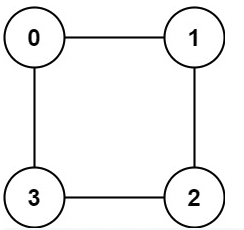

## S.785_Is Graph Bipartite?



Input: graph = [[1,3],[0,2],[1,3],[0,2]]

Output: true

Explanation: We can partition the nodes into two sets: {0, 2} and {1, 3}.

思路： 有1个array存储，每个node是在哪一个set里面，一但出现冲突就停止。return false。

```javascript
var isBipartite = function (graph) {
    const n = graph.length;
    const visited = Array(n).fill(0);

    for (let i = 0; i < n; i++) {
        if (visited[i] == 0) {
            let queue = [i];
            visited[i] = 1;
            while (queue.length) {
                const curr = queue.shift();
                for (let nei of graph[curr]) {
                    if (visited[nei] === visited[curr]) {
                        return false;
                    }
                    if (visited[nei] == 0) {
                        visited[nei] = -visited[curr];
                        queue.push(nei);
                    }
                }
            }
        }
    }
    return true;
};
```