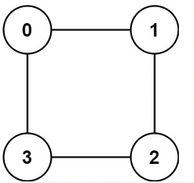

## S.785_Is Graph Bipartite?



Input: graph = [[1,3],[0,2],[1,3],[0,2]]

Output: true

Explanation: We can partition the nodes into two sets: {0, 2} and {1, 3}.

思路： 有1个array存储，每个node是在哪一个set里面，一但出现冲突就停止。return false。

```javascript
var isBipartite = function (graph) {
    const n = graph.length;
    const visited = Array(n).fill(0);

    for (let i = 0; i < n; i++) {
        if (visited[i] == 0) {
            let queue = [i];
            visited[i] = 1;
            while (queue.length) {
                const curr = queue.shift();
                for (let nei of graph[curr]) {
                    if (visited[nei] === visited[curr]) {
                        return false;
                    }
                    if (visited[nei] == 0) {
                        visited[nei] = -visited[curr];
                        queue.push(nei);
                    }
                }
            }
        }
    }
    return true;
};
```

## S.200. Number of Islands
```javascript
/**
 * 200. Number of Islands
 * Given a 2d grid map of '1's (land) and '0's (water), count the number of islands.
 * An island is surrounded by water and is formed by connecting adjacent lands horizontally or vertically.
 * You may assume all four edges of the grid are all surrounded by water.

 Example 1:

 11110
 11010
 11000
 00000
 Answer: 1

 Example 2:

 11000
 11000
 00100
 00011
 Answer: 3

 time : O(m * n)
 space : O(n)
 思路： 二维矩阵： DFS(通用的解法), BFS
 * @param {character[][]} grid
 * @return {number}
 */
function dfs(grid, i, j) {
    if (i < 0 || j < 0 || i >= grid.length || j >= grid[0].length) {
        return;
    }
    grid[i][j] = '0';
    dfs(grid, i + 1, j);
    dfs(grid, i - 1, j);
    dfs(grid, i, j + 1);
    dfs(grid, i, j - 1);
}

var numIslands = function(grid) {
    let m = grid.length;
    let n = grid[0].length;
    let res = 0;
    if (m == 0) return 0;
    for (let i = 0; i < m; i++) {
        for (let j = 0; j < n; j++) {
            if (grid[i][j] == '1') {
                dfs(grid, i, j);
                res++;
            }
        }
    }
    return res;
};
```