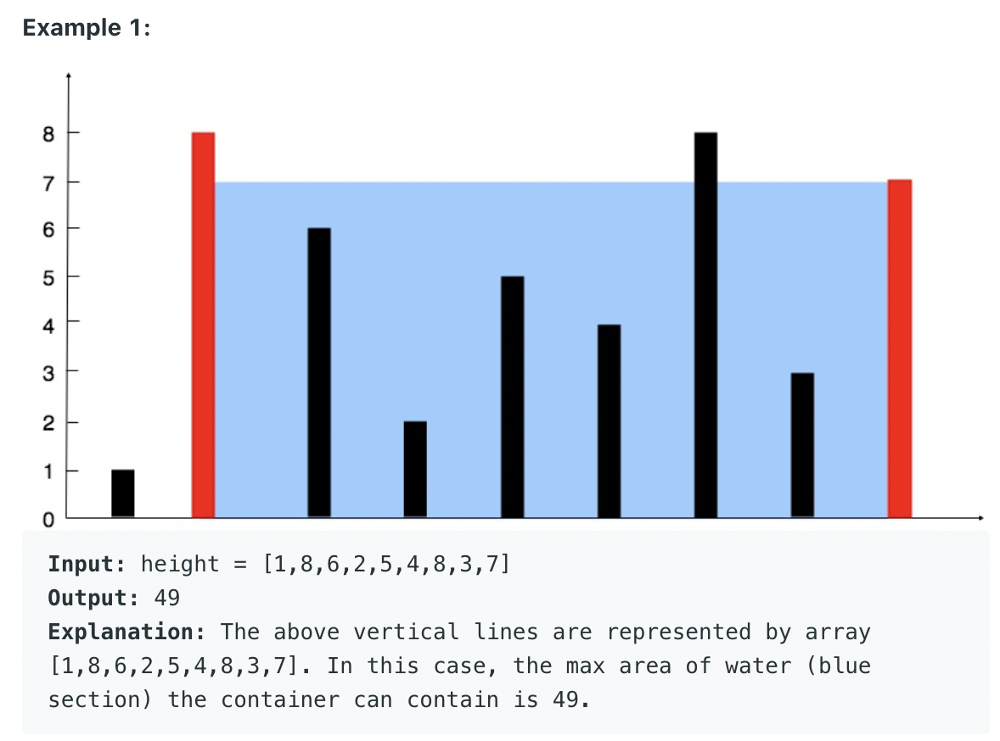
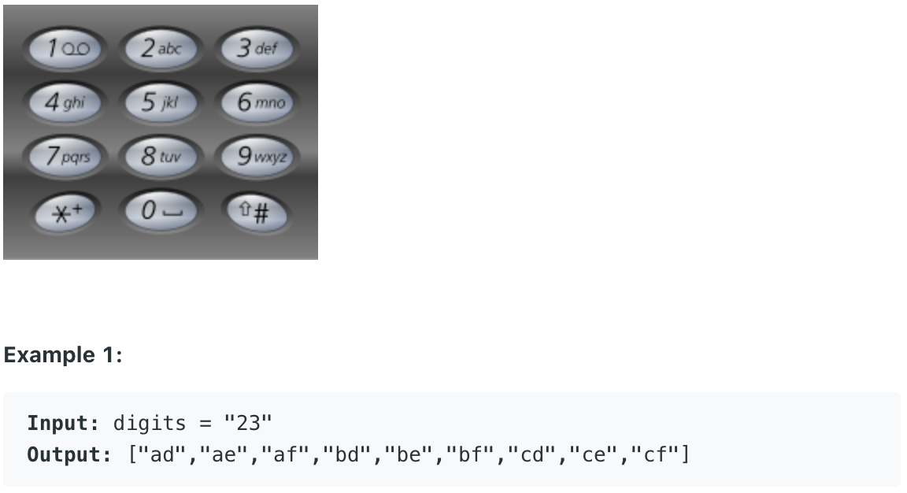

# Leetcode刷题笔记（数组部分）


## S.1_Two Sum

**思路1**：

使用hash表，假设a+b=target。

1. 遍历元素，假设每次遍历到的元素是a，如果map中不包含这个target-a，则把target-a作为key进行存储，当前下标作为value进行存储。
2. 由于存储的是差值，当下次再遍历到该这个key的时候，就证明我们已经找到了这两个元素。
3. 存储两次的下标就行。

**代码**：时间复杂度O(n)

```javascript
var twoSum = function(nums, target) {
    let arr = [];
    let map = new Map();
    for (let i = 0; i < nums.length; i++) {
        if (map.has(target - nums[i])) {
            arr[0] = map.get(target - nums[i]);
            arr[1] = i;
            break;
        }
        map.set(nums[i], i);
    }
    return arr; 
};	

console.log(twoSum([1, 2, 3, 7, 8], [9])); // [ 1, 3 ]
```

## S.167. Two Sum II - Input array is sorted
```javascript
/**
 * 167. Two Sum II - Input array is sorted
 Input: numbers={2, 7, 11, 15}, target=9
 Output: index1=1, index2=2

 time : O(n)
 space : O(1)
 * @param {number[]} numbers
 * @param {number} target
 * @return {number[]}
 */
var twoSum = function(nums, target) {
    if (nums == null || nums.length < 2) {
        return new Array(-1,-1);
    }

    let left = 0;
    let right = nums.length - 1;
    while (left < right) {
        let sum = nums[left] + nums[right]
        if (sum == target) {
            return new Array(left+1, right+1);
        } else if (sum > target) {
            right--;
        } else {
            left++;
        }
    }
    return new Array(-1, -1);
};
```

## S.15_3Sum

原题地址：

[http://www.lintcode.com/problem/3sum/](http://www.lintcode.com/problem/3sum/)

思路：

1. 把数组排序。
2. 最外层使用一个循环，遍历数组元素，范围（0~num.length-1）。
3. 内层使用一个循环和两个指针，分别从头部和尾部开始移动，在外层循环固定到一个数的情况下，头部向后移动，尾部向前移动，直至满足a+b+c=0。

代码：
```javascript
/**
 *
 For example, given array S = [-1, 0, 1, 2, -1, -4],
 A solution set is:
 [
 [-1, 0, 1],
 [-1, -1, 2]
 ]

 [-4, -1, -1, 0, 1, 2]

 time : O(n^2);
 space : O(n^2);
 * @param nums
 * @return
 */

var threeSum = function(nums) {
    let results = [];
    nums = nums.sort((a, b) => a - b);
    for (let i = 0; i < nums.length - 2; i++) {
        if (i > 0 && nums[i] == nums[i-1]) continue;
        let low = i + 1;
        let high = nums.length - 1;
        let sum = 0 - nums[i];

        while (low < high) {
            if (nums[low] + nums[high] === sum) {
                let res = [nums[i], nums[low], nums[high]];
                results.push(res);
                while(low < high && nums[low] == nums[low+1]) low++;
                while(low < high && nums[high] == nums[high-1]) high--;
                low++;
                high--;
            } else if (nums[low] + nums[high] < sum){
                low++;
            } else {
                high--;
            }
        }
    }
    return results;
};

console.log(threeSum([-2,-1,-1,1,1,2,2])); // [ [ -2, 1, 1 ], [ -1, -1, 2 ] ]
```

## S.259. 3Sum Smaller
```javascript
/**
 * 259. 3Sum Smaller
 * nums = [-2, 0, 1, 3], and target = 2.
 * time : O(n^2);
 * space : O(1);
 * @param {number[]} nums
 * @param {number} target
 * @return {number}
 */
var threeSumSmaller = function(nums, target) {
    let res = 0;
    nums.sort((a,b) => a-b);
    for (let i = 0; i < nums.length - 2; i++) {
        let left = i + 1;
        let right = nums.length - 1;
        while(left < right) {
            if (nums[i] + nums[left] + nums[right] < target) {
                res += right - left;
                left++;
            } else {
                right--;
            }
        }
    }
    return res;
};
let nums = [3,1,0,-2];
console.log(threeSumSmaller(nums, 4)); // 3
```

##S.18_4Sum

原题地址：

https://leetcode.com/problems/4sum/

思路：

1. 对数组排序。
2. 外面使用两层循环，枚举数组中的a 和b。内层使用being和end两个指针代表c和d，分别从两端往中间遍历。
3. 当a+b+c+d=target时，保存一次答案，如果a+b+c+d>target，end--；如果a+b+c+d<target，begin++。

代码：

```javascript
var fourSum = function(nums, target) {
    let res = [];
    nums.sort((a, b) => a - b);

    for (let i = 0; i < nums.length - 3; i++) {
        if (i > 0 && nums[i] == nums[i-1]) continue;
        for (let j = i + 1; j < nums.length - 2; j++) {
            if (j > i + 1 && nums[j] === nums[j-1]) continue;
            let low = j + 1;
            let high = nums.length - 1;
            let sum = target - nums[i] -nums[j];
            while(low < high) {
                if (low < high && sum === nums[low] + nums[high]) {
                    let cur = [nums[i], nums[j], nums[low], nums[high]];
                    while(low < high && nums[low] == nums[low+1]) low++;
                    while(low < high && nums[high] == nums[high-1]) high--;
                    res.push(cur);
                    low++;
                    high--;
                } else if (low < high && sum > nums[low] + nums[high]){
                    low++;
                }else {
                    high--;
                }
            }
        }
    }
    return  res;
};

console.log(fourSum([-2,-1,-1,1,1,2,2], 0)); // [ [ -2, -1, 1, 2 ], [ -1, -1, 1, 1 ] ]

```


## S.27_Remove Element

原题地址：

https://leetcode.com/problems/remove-element/

思路：

找出数组中不等于val的值有多少个，该值作为数组的新length，并且保证前length个元素不包含val。

i 遍历所有元素，index记录val的位置，并且把和val值不同的元素覆盖到val的位置。

代码：

```javascript
/**
 * @param {number[]} nums
 * @param {number} val
 * @return {number}
 */
var removeElement = function(nums, val) {
        let res = 0;
        for (let i = 0; i < nums.length; i++) {
            if (nums[i] != val) {
                nums[res++] = nums[i];
            }
        }
        return res;
    };

console.log(removeElement([1,2,3,4,5], 5)); // 4
```

## S.189. Rotate Array
```javascript
/**
 * 189. Rotate Array
 * Rotate an array of n elements to the right by k steps.

 For example, with n = 7 and k = 3, the array [1,2,3,4,5,6,7] is rotated to [5,6,7,1,2,3,4].

 Note:
 Try to come up as many solutions as you can, there are at least 3 different ways to solve this problem.

 * @param {number[]} nums
 * @param {number} k
 * @return {void} Do not return anything, modify nums in-place instead.
 */

// ======================================================Method 1===============================================================
//time : O(n)  space : O(n)
var rotate = function(nums, k) {
    let temp = new Array(nums.length);
    for (let i = 0; i < nums.length; i++) {
        // 注意这里也是一个技巧 （0 + 3 => k） % 7
        // [1,2,3,4,5,6,7]
        // [      1,2,3,4
        temp[(i+k) % nums.length] = nums[i];
    }
    // nums = [...temp];
    for (let i = 0; i < nums.length; i++) {
        nums[i] = temp[i];
    }
    console.log(nums);
};

let arr = [1,2,3,4,5,6,7];
rotate(arr,3);

// ======================================================Method 2===============================================================
//time : O(n)  space : O(1)
/**
 Original List                   : 1 2 3 4 5 6 7
 After reversing all numbers     : 7 6 5 4 3 2 1
 After reversing first k numbers : 5 6 7 4 3 2 1
 After revering last n-k numbers : 5 6 7 1 2 3 4 --> Result
 */
function helper(s, start, end) {
    while (start < end) {
        let temp = s[start];
        s[start] = s[end];
        s[end] = temp;
        start++;
        end--;
    }
    return s;
}
var rotate = function(nums, k) {
    k = k % nums.length;
    helper(nums, 0, nums.length-1);
    helper(nums,0,k-1);
    helper(nums,k, nms.length-1);
};
```

## S.11_Container With Most Water


https://leetcode.com/problems/container-with-most-water/

**思路1**： 两个指针一个从前走，一个从后走。水的容量区别于低的那一边。

```javascript
/**
 * @param {number[]} height
 * @return {number}
 */
var maxArea = function(height) {
    var res = 0;
    var left = 0;
    var right = height.length - 1;
    while (left < right) {
        res = Math.max(res, Math.min(height[left], height[right]) * (right - left));
        if (height[left] < height[right]) {
            left++;
        } else {
            right--;
        }
    }
    return res;
};
```
## S.17_Letter Combinations of a Phone Number


```javascript
/**
 * @param {string} digits
 * @return {string[]}
 */
var letterCombinations = function(digits) {
    if (digits.length == 0) return [];

    let M = new Map();
    M.set('2', ['a', 'b', 'c']);
    M.set('3', ['d', 'e', 'f']);
    M.set('4', ['g', 'h', 'i']);
    M.set('5', ['j', 'k', 'l']);
    M.set('6', ['m', 'n', 'o']);
    M.set('7', ['p', 'q', 'r', 's']);
    M.set('8', ['t', 'u', 'v']);
    M.set('9', ['w', 'x', 'y', 'z']);

    let prod = (a, b) => {
        let arr = [];
        for (let i = 0; i < a.length; i++) {
            for (let j = 0; j < b.length; j++) {
                arr.push([...a[i], ...b[i]]);
            }
        }
        return arr;
    }

    let res = M.get(digits[0]);
    for (let i = 1; i < digits.length; i++) {
        res = prod(res, M.get(digits[i]));
    }
    return res.map(i => [...i].join(''));
};


console.log(letterCombinations('23'));
```

## S.278_First Bad Version
n: 表示有几个版本， 找出其中一个版本是坏的。

Input: n = 5, bad = 4
Output: 4
Explanation:
call isBadVersion(3) -> false
call isBadVersion(5) -> true
call isBadVersion(4) -> true
Then 4 is the first bad version.

```javascript
/**
 * Definition for isBadVersion()
 * 
 * @param {integer} version number
 * @return {boolean} whether the version is bad
 * isBadVersion = function(version) {
 *     ...
 * };
 */
var solution = function(isBadVersion) {
    return function(n) {
        let start = 1;
        let end = n;

        while(start <= end) {
            const mid = start + Math.floor((end - start) / 2);
            if (isBadVersion(mid)) {
                end = mid - 1;
            } else {
                start = mid + 1;
            }
        }
        return start;
    };
};
```


## S.367_Valid Perfect Square

Input: num = 16
Output: true

```javascript
/**
 *
 * time : O(logn) space : O(1)
 * @param {number} num
 * @return {boolean}
 */
var isPerfectSquare = function(num) {
    let low = 1, high = num;
    while(low <= high) {
        let mid = low + Math.floor((high - low)/2);
        if (mid * mid == num) {
            return true;
        } else if(mid * mid < num) {
            low = mid + 1;
        } else {
            high = mid -1;
        }
    }
    return false;
};

```

## S.69_Sqrt(x)

Input: x = 4
Output: 2

```javascript
/**
 * 69. Sqrt(x)
 * time : O(logn) space : O(1)
 * @param x
 * @return
 */
var mySqrt = function(x) {
        if (x == 0) return 0;
        let low = 1, high = x;
        while(low <= high) {
            let mid = low + Math.floor((high - low)/2);
            if (mid * mid == x) {
                return mid;
            } else if(mid * mid < x) {
                low = mid + 1;
            } else {
                high = mid -1;
            }
        }
        if (high * high < x) {
            return high;
        } else {
            return low;
        }
    };
```


## S.31_Next Permutation

原题地址：https://leetcode.com/problems/next-permutation/


代码：

```javascript
/**
 再来看下面一个例子，有如下的一个数组: 1　　2　　7　　4　　3　　1
 下一个排列为：1　　3　　1　　2　　4　　7
 那么是如何得到的呢，我们通过观察原数组可以发现，如果从末尾往前看，数字逐渐变大，到了2时才减小的，然后再从后往前找第一个比2大的数字，是3，那么我们交换2和3，再把此时3后面的所有数字转置一下即可，步骤如下：

 x   y
 1　　2　　7　　4　　3　　1

 1　　2　　7　　4　　3　　1

 1　　3　　7　　4　　2　　1

 1　　3　　1　　2　　4　　7

 find the pivot point (x=>2,y=>7), if not found, reverse [0,n) and return
 find the smallest element z=>3  > x from [y=>7, n=>1)
 swap (x, z)
 reverse [y, n)

 time : O(n);
 space : O(1);
 * @param {number[]} nums
 */
var nextPermutation = function(nums) {
        let firstSmall = -1;
        for (let i = nums.length - 2; i >= 0; i--) {
            if (nums[i] < nums[i+1]) {
                firstSmall = i;
                break;
            }
        }

        if (firstSmall == -1) {
            nums.reverse();
            return;
        }

        let firstLarge = -1;
        for (let i = nums.length - 1; i > firstSmall; i--) {
            if (nums[i] > nums[firstSmall]) {
                firstLarge = i;
                break;
            }
        }

        const swap = function (arr, i, j) {
            let temp = 0;
            temp = nums[i];
            nums[i] = nums[j];
            nums[j] = temp;
        }

        swap(nums, firstSmall, firstLarge);

        const reverseArr = function (arr, i, j) {
            while (i < j) {
                swap(arr, i, j);
                i++;
                j--;
            }
        }
        reverseArr(nums,firstSmall+1, nums.length - 1);
    };
nums = [1,2,7,4,3,1];
// nums = [3,2,1];
nextPermutation(nums)
console.log(nums); // [ 1, 3, 1, 2, 4, 7 ]
```


## S.36_Valid Sudoku

原题地址：https://leetcode.com/problems/valid-sudoku/

思路： 在已经给出的数独中，判断每一行、每一列、每一个小9宫格不存在重复元素。

代码：

```javascript
var isValidSudoku1 = function(board) {
    let seen = new Set();
    for (let i = 0; i < 9; i++) {
        for (let j = 0; j < 9; j++) {
            let number = board[i][j];
            // 使用i / 3 + "-" + j / 3 得到对应第几行第几列的方块
            // 不用弄成一个数字, 例如第3个方块. 采用行列的形式更直观
            if (number != '.'){
                if (seen.has(number + " in row " + i)) {
                    return false;
                }else {
                    seen.add(number + " in row " + i);
                }

                if (seen.has(number + " in column " + j)) {
                    return false;
                }else {
                    seen.add(number + " in column " + j);
                }

                if (seen.has(number + " in block " + Math.floor(i / 3) + "-" + Math.floor(j / 3))) {
                    return false;
                }else {
                    seen.add(number + " in block " + Math.floor(i / 3) + "-" + Math.floor(j / 3));
                }
            }
        }
    }
    return true;
}
```

## S.48_Rotate Image

原题地址：https://leetcode.com/problems/rotate-image/

思路：

纯粹考察如何旋转的技巧。

1.先沿着副对角线交换元素。

2.再沿着水平线以镜像方式交换所有元素，就是顺时针旋转90度的结果。

代码：

```javascript
var rotate = function(matrix) {
    let n = matrix.length;
    let m = matrix[0].length;

    for (let i = 0; i < n; i++) {
        for (let j = i; j < m; j++){
            let temp = matrix[i][j];
            matrix[i][j] = matrix[j][i];
            matrix[j][i] = temp;
        }
    }

    for (let i = 0; i < n; i++) {
        for (let j = 0; j < m / 2; j++) {
            let temp = matrix[i][j];
            matrix[i][j] = matrix[i][m-1-j];
            matrix[i][m-1-j] = temp;
        }
    }
    return matrix;
};

let matrix = [[1,2,3],[4,5,6],[7,8,9]];
console.log(rotate(matrix)); // [ [ 7, 4, 1 ], [ 8, 5, 2 ], [ 9, 6, 3 ] ]
```

## S.66_Plus One

原题地址：https://leetcode.com/problems/plus-one/

思路：

这套题目是一个实现题。大数题目。

1.先对原数组进行处理。从数组最后一位开始往前检查，如果当前数字是<9的，说明你加1无需进位，从循环跳出即可，如果当前数字等于9，说明加1涉及进位，且加1后当前数字应记为0，继续循环处理。

2.当对原数组处理完后，还需要判断当前第0位是不是已经变为0了，如果已经变为0了说明是类似99+1这种，需要进位。其他则不需要。

代码：

```javascript
/**
 * * 66. Plus One
 * Given a non-negative integer represented as a non-empty array of digits, plus one to the integer.

 You may assume the integer do not contain any leading zero, except the number 0 itself.

 The digits are stored such that the most significant digit is at the head of the list.

 case1 : 1011 1012
 case2 : 1099 1100
 case3 : 9999 10000

 time : O(n);
 space : O(n);
 * @param {number[]} digits
 * @return {number[]}
 */
var plusOne = function(digits) {
    let len = digits.length;
    for (let i = len - 1; i >= 0; i--) {
        if (digits[i] < 9) {
            digits[i] = digits[i] + 1;
            return digits;
        } else {
            digits[i] = 0
        }
    }

    let res = new Array(len+1).fill(0);
    res[0] = 1
    return res;
};

let nums = [1,0,1,1];
console.log(plusOne(nums)); // [ 1, 0, 1, 2 ]

```
## S.55_Jump Game
给出一个非负正数数组，初始情况下就是在第一个的位置。每个元素的值代表最大可以跳跃的步数。 检查能不能跳到最后一步。

Example 1:

Input: nums = [2,3,1,1,4]
Output: true
Explanation: Jump 1 step from index 0 to 1, then 3 steps to the last index.


```javascript
/**
 * @param {number[]} nums
 * @return {boolean}
 * For example
 * A = [2,3,1,1,4] return true;
 */
var canJump = function(nums) {
    let max = 0;
    for (let i = 0; i < nums.length; i++) {
        if (i > max) return false;
        let cur = i + nums[i];
        max = Math.max(cur, max);
    }
    return max >= nums.length - 1;
};
```

## S.45_Jump Game II
与上一题的区别
Your goal is to reach the last index in the minimum number of jumps.

```javascript
var jump = function(nums) {
    let start = 0, end = 0, step = 0;
    if (nums.length == 1) return 0;
    while (start <= end) {
        let end_new = end;
        for (let i = start; i <= end; i++) {
            end_new = Math.max(end_new, nums[i]+i);
            if (end_new >= nums.length - 1) {
                return step+1;
            }
        }
        step++;
        start = end + 1;
        end = end_new;
    }
};

console.log(removeDuplicates([2,3,1,1,4]));
```

##S.118_Pascal's Triangle
```javascript
/**
 * 118. Pascal's Triangle
 * For example, given numRows = 5,
 Return

 [
     [1],
    [1,1],
   [1,2,1],
  [1,3,3,1],
 [1,4,6,4,1]
 ]

 time : O(n^2)
 space : O(n)

 * @param {number} numRows
 * @return {number[][]}
 */
var generate = function(numRows) {
    let res = [];
    let list = [];
    for (let i = 0; i < numRows; i++) {
        // insert
        list.splice(0,0,1);
        let size = list.length; // 这个很重要，list是在动态变化的，要先把他原来的长度先存来。
        for (let j = 1; j < size - 1; j++) {
            // replace
            list.splice(j,1,list[j] + list[j+1]);
        }
        // shallow copy
        res.push(list.slice());
    }
    return res;
};
```

##S.119_Pascal's Triangle II
```javascript
/**
 * 119. Pascal's Triangle II
 * [
     [1],
    [1,1],
   [1,2,1],
  [1,3,3,1],
 [1,4,6,4,1]
 ]
 * For example, given k = 3,
 Return [1,3,3,1].

 time : O(n^2)
 space : O(n)
 * @param {number} rowIndex
 * @return {number[]}
 */
var getRow = function(rowIndex) {
    let numRows = rowIndex + 1
    let res = [];
    for (let i = 0; i < numRows; i++) {
        // insert
        res.splice(0,0,1);
        let size = list.length;
        for (let j = 1; j < size - 1; j++) {
            // replace
            res.splice(j,1,list[j] + list[j+1]);
        }
    }
    return res[rowIndex];
};
```

##S.120_Triangle
```javascript
/**
 * 120. Triangle
 * Given a triangle, find the minimum path sum from top to bottom. Each step you may move to adjacent numbers
 * on the row below.

 For example, given the following triangle
 [
    [2],
   [3,4],
   [6,5,7],
 [4,1,8,3]
 ]
 The minimum path sum from top to bottom is 11 (i.e., 2 + 3 + 5 + 1 = 11).

 i : j
 i + 1 : j, j + 1

 res = [4, 1, 8, 3, 0]
 res = [7, 6, 10]
 res = [9, 10]
 res = [2]

 time : O(n^2)
 space : O(n)
 * // Definition for a Node.
 * function Node(val, left, right, next) {
 *    this.val = val === undefined ? null : val;
 *    this.left = left === undefined ? null : left;
 *    this.right = right === undefined ? null : right;
 *    this.next = next === undefined ? null : next;
 * };
 */

/**
 * @param {Node} root
 * @return {Node}
 */
/**
 * @param {number[][]} triangle
 * @return {number}
 */
var minimumTotal = function(triangle) {
    let res = new Array(triangle.length + 1).fill(0);
    for (let i = triangle.length -1; i >= 0;i--) {
        for (let j = 0; j < triangle[i].length; j++) {
            res[j] = Math.min(res[j], res[j+1]) + triangle[i][j];
        }
    }
    return res[0];
};
```

## 121. Best Time to Buy and Sell Stock
```javascript
/**
 * 121. Best Time to Buy and Sell Stock
 * Say you have an array for which the ith element is the price of a given stock on day i.

 If you were only permitted to complete at most one transaction (ie,
 buy one and sell one share of the stock), design an algorithm to find the maximum profit.
 Input: [7, 1, 5, 3, 6, 4]
 Output: 5

 max. difference = 6-1 = 5 (not 7-1 = 6, as selling price needs to be larger than buying price)

 time : O(n);
 space : O(1);
 * @param {number[]} prices
 * @return {number}
 */
var maxProfit = function(prices) {
    if (prices == null || prices.length < 2) return 0;
    let min = prices[0];
    let profit = 0
    for (let i = 1; i < prices.length; i++) {
        min = Math.min(min, prices[i]);
        profit = Math.max(profit, prices[i] - min);
    }
    return profit;
};

```

## S.122_Best Time to Buy and Sell Stock II
```javascript
/**
 * 122. Best Time to Buy and Sell Stock II
 * Say you have an array for which the ith element is the price of a given stock on day i.

 Design an algorithm to find the maximum profit. You may complete as many transactions as you like (ie, buy one and sell one share of the stock multiple times). However,
 you may not engage in multiple transactions at the same time (ie, you must sell the stock before you buy again).

 case : [5, 1, 2, 3, 4]
           /     \
 -----   /        \
 有这三种情况，只有第二种情况才可能有买卖

 time : O(n);
 space : O(1);
 * @param {number[]} prices
 * @return {number}
 */
var maxProfit = function(prices) {
    if (prices == null || prices.length < 2) return 0;
    let profit = 0;
    for (let i = 1; i < prices.length; i++) {
        if (prices[i] > prices[i-1]) {
            profit += prices[i] - prices[i-1];
        }
    }
    return profit;
};
```

## S.123_Best Time to Buy and Sell Stock III
```javascript
/**
 * @param {number[]} prices
 * @return {number}
 */
var maxProfit = function (prices) {
    let buy1 = -Infinity, buy2 = -Infinity;
    let sell1 = 0, sell2 = 0;
    for (price of prices) {
        buy1 = Math.max(buy1, - price);
        sell1 = Math.max(sell1, buy1 + price);
        buy2 = Math.max(buy2, sell1 - price);
        sell2 = Math.max(sell2, buy2 + price);
    }
    return sell2;
};


let prices = [7,6,4,3,1];
console.log(maxProfit(prices));
```

## S.73_Set Matrix Zeroes

原题地址：https://leetcode.com/problems/set-matrix-zeroes/

思路：这是一道实现题，
遍历数组， 第一行，第一列全部变为0。
然后从第二行，第二列开始遍历。 设为0。

很巧妙的地方不能从第0列第0行。 因为。会全部变0； let matrix = [[0,1,2,0],[3,4,5,2],[1,3,1,5]] =》 [[0,0,0,0],[3,4,5,2],[1,3,1,5]] =》 [[0,0,0,0],[0,0,0,0],[0,0,0,0]]


代码：

```javascript
/* 73. Set Matrix Zeroes
    [
    [1, 0, 1, 1],
        [1, 1, 0, 0],
        [0, 1, 1, 1],
        [1, 1, 1, 1]
    ]

time : O(n * m)
space : O(1)
 */
var setZeroes = function(matrix) {
   if(matrix == null || matrix.length == 0) return;
   if (matrix[0] == null || matrix[0].length == 0) return;
   let m = matrix.length;
   let n = matrix[0].length;
   let row = false;
   let col = false;
   for (let i = 0; i < m; i++) {
      for (let j = 0; j < n; j++) {
         if (matrix[i][j] == 0) {
            matrix[0][j] = 0;
            matrix[i][0] = 0;
            if (i == 0) row = true;
            if (j == 0) col = true;
         }
      }
   }

   for (let i = 1; i < m; i++) {
      if (matrix[i][0] == 0) {
         for (let j = 0; j < n; j++) {
            matrix[i][j] = 0;
         }
      }
   }
   for (let j = 1; j < n; j++) {
      if (matrix[0][j] == 0) {
         for (let i = 0; i < m; i++) {
            matrix[i][j] = 0;
         }
      }
   }

   if (row) {
      for (let j = 0; j < n; j++) {
         matrix[0][j] = 0;
      }
   }
   if (col) {
      for (let i = 0; i < m; i++) {
         matrix[i][0] = 0;
      }
   }
};
```

## S.139_Word Break
```javascript
/**
 * 139. Word Break
 * Given a non-empty string s and a dictionary wordDict containing a list of non-empty words,
 * determine if s can be segmented into a space-separated sequence of one or more dictionary words.
 * You may assume the dictionary does not contain duplicate words.

 For example, given
 s = "leetcode",
 dict = ["leet", "code"].

 Return true because "leetcode" can be segmented as "leet code".

 time : O(n^2) ～ O(n^4);
 space : O(n);

 contains 时间：O(n)
 substring 时间：O(n)

 s = "leetcode",
 dict = ["leet", "code"]
 又是一道dp的题目。 解释视频： https://www.youtube.com/watch?v=H2EgWq-45CY

 * @param {string} s
 * @param {string[]} wordDict
 * @return {boolean}
 */
var wordBreak = function(s, wordDict) {
    let dp = new Array(s.length + 1).fill(false);
    dp[0] = true;
    for (let i = 1; i <= s.length; i++) {
        for (let j = 0; j < i; j++) {
            if (dp[j] && wordDict.includes(s.substring(j,i))){
                dp[i] = true;
                break;
            }
        }
    }
    return dp[s.length];
};
```

## S.134_Gas Station

原题地址：https://leetcode.com/problems/gas-station/

代码：

```javascript
/**
 * 134. Gas Station
 * There are N gas stations along a circular route, where the amount of gas at station i is gas[i].

 You have a car with an unlimited gas tank and it costs cost[i] of gas to travel from station i to its next station (i+1).
 You begin the journey with an empty tank at one of the gas stations.

 Return the starting gas station's index if you can travel around the circuit once, otherwise return -1.

 非常经典的一道题。可以转换成求最大连续和做，但是有更简单的方法。基于一个数学定理：

 如果一个数组的总和非负，那么一定可以找到一个起始位置，从他开始绕数组一圈，累加和一直都是非负的
 （证明貌似不难，以后有时间再补）


 有了这个定理，判断到底是否存在这样的解非常容易，只需要把全部的油耗情况计算出来看看是否大于等于0即可。

 那么如何求开始位置在哪？

 注意到这样一个现象：

 1. 假如从位置i开始，i+1，i+2...，一路开过来一路油箱都没有空。说明什么？说明从i到i+1，i+2，...肯定是正积累。
 2. 现在突然发现开往位置j时油箱空了。这说明什么？说明从位置i开始没法走完全程(废话)。那么，我们要从位置i+1开始重新尝试吗？不需要！为什么？
 因为前面已经知道，位置i肯定是正积累，那么，如果从位置i+1开始走更加没法走完全程了，因为没有位置i的正积累了。
 同理，也不用从i+2，i+3，...开始尝试。所以我们可以放心地从位置j+1开始尝试。

 https://www.cnblogs.com/boring09/p/4248482.html
 https://www.youtube.com/watch?v=PY0GUlRFTxg

 time : O(n)
 space : O(1)
 * @param {number[]} gas
 * @param {number[]} cost
 * @return {number}
 */
var canCompleteCircuit = function(gas, cost) {
    if (gas == null || cost == null || gas.length == 0 || cost.length == 0) return -1;
    let total = 0; // 总油量-总消耗
    let curr = 0; // 当下剩下的油量
    let start = 0; // 表示起点
    for (let i = 0; i < cost.length; i++) {
        curr += gas[i] - cost[i];
        if (curr < 0) {
            start = i + 1;
            curr = 0;
        }
        total += gas[i] - cost[i];
    }

    return total >= 0? start : -1;
};
```

## S.135_Candy

原题地址：https://leetcode.com/problems/candy/

思路：

这道题和Trapping water那个是一样的想法，因为无论是水坑还是得到糖的小朋友，影响因素都不只一边，都是左右两边的最小值/最大值来决定的。做法是分别从左右两边遍历数组。

1.leftResult数组存从左边遍历，当前小朋友对比其左边小朋友，他能拿到糖的数量；

2.rightResult数组存从右边遍历，当前小朋友对比其右边小朋友，他能拿到的糖的数量。

3.最后针对这两个数组，每个小朋友能拿到的糖的数量就是这两个数最大的那个数，求总加和就好了。

代码：

```javascript
/**
 * 135. Candy
 * There are N children standing in a line. Each child is assigned a rating value.

 You are giving candies to these children subjected to the following requirements:

 Each child must have at least one candy.
 Children with a higher rating get more candies than their neighbors.
 What is the minimum candies you must give?

 ratings:     [4, 5, 1, 1, 3, 7]
 candies:     [1, 1, 1, 1, 1, 1]

 ratings:     [4, 5, 1, 1, 3, 7]
 candies:     [1, 2, 1, 1, 2, 3]

 ratings:     [4, 5, 1, 1, 3, 7]
 candies:     [1, 2, 1, 1, 2, 3]

 time : O(n)
 space : O(n)
 * @param {number[]} ratings
 * @return {number}
 */
var candy = function(ratings) {
    let candies = new Array(ratings.length).fill(1);
    for (let i = 1; i < candies.length; i++) {
        if (ratings[i] > ratings[i-1]) {
            candies[i] = candies[i-1] + 1;
        }
    }

    for (let i = candies.length - 2; i >= 0; i--) {
        if (ratings[i] > ratings[i+1] && candies[i] <= candies[i+1]) {
            candies[i] = candies[i+1] + 1;
        }
    }

    let res = 0;
    for (let ele of candies) {
        res += ele;
    }
    return res;
};
```

## S.136_Single Number

原题地址：https://leetcode.com/problems/single-number/

思路：

这道题目要求使用线性的时间复杂度，和很少的附加空间。运用亦或^，相同为0，不同为1的性质。

0^x = x.设定一个初始值num=0，然后和数组中所有元素亦或，最后得到的那个值就是出现次数为奇数次的值。 因此出现次数为1次的数字就产生了。

代码：

```javascript
var singleNumber = function(nums) {
    let res = nums[0];
    for (let i = 1; i < nums.length; i++) {
        res ^= nums[i];
    }
    return res;
};
```

##S.137_ Single Number II
原题地址：https://leetcode.com/problems/single-number-ii/
思路1：

扫描数组，把数据读入hashMap中，然后遍历hashMap，找到按个次数不是3的元素。空间上增加了hashMap的空间，时间上多遍历一次hashMap。

代码：

```javascript
const singleNumber = (nums) => {
    let set = new Set(nums);
    let res = [...set].reduce((acc, cur) => acc + cur);
    let total = res * 3;
    let result = nums.reduce((acc, cur) => acc + cur);
    let num = (total - result) / 2;
    return num;
};
```

## S.219. Contains Duplicate II
```javascript
/**
 * 219. Contains Duplicate II
 * Given an integer array nums and an integer k,
 * return true if there are two distinct indices i and j in the array such that nums[i] == nums[j] and abs(i - j) <= k.
 * Example 1:    0, 1,2,3
 Input: nums = [1,2,3,1], k = 3
 Output: true

 Example 2:     0,1,2,3
 Input: nums = [1,0,1,1], k = 1
 Output: true
 * @param {number[]} nums
 * @param {number} k
 * @return {boolean}
 */
var containsNearbyDuplicate = function(nums, k) {
    let map = new Map();
    for (let i = 0; i < nums.length; i++) {
        if (map.has(nums[i])) {
            if ( (i - map.get(nums[i])) <= k) {
                return true;
            }
        }
        map.set(nums[i], i);
    }
    return false;
};
```

##S.215. Kth Largest Element in an Array
```javascript
/**
 * /**
 * 215. Kth Largest Element in an Array
 * 最坏：O(n^2) 平均：O(nlogn)
 * space : O(1)
 * @param {number[]} nums
 * @param {number} k
 * @return {number}
 */
var findKthLargest = function(nums, k) {
    nums = nums.sort((a,b) => a-b);
    return nums[nums.length - k];
};

console.log(findKthLargest([3,2,3,1,2,4,5,5,6], 3));
```

## S.221. Maximal Square
```javascript
/**
 * 221. Maximal Square
 * Given a 2D binary matrix filled with 0's and 1's, find the largest square containing only 1's and return its area.

 For example, given the following matrix:

 1 0 1 0 0
 1 0 1 1 1
 1 1 1 1 1
 1 0 0 1 0
 Return 4.

 time : O(m * n)
 space : O(m * n)
 思路：最大的二维矩阵
 * @param {character[][]} matrix
 * @return {number}
 */
var maximalSquare = function(matrix) {
    if(!matrix.length) return 0;
    const R_NUM = matrix.length, C_NUM = matrix[0].length;
    // const dp = Array.from({length: R_NUM+1}, () => Array(C_NUM+1).fill(0));  // output: 4

    const dp = [...Array(R_NUM+1)].map(x=>Array(C_NUM+1).fill(0))
    // let dp = new Array(R_NUM+1).fill(new Array(C_NUM+1).fill(0)); // output: 9
    let maxLen = 0;
    for(let r = 1; r <= R_NUM; r++) {
        for(let c = 1; c <= C_NUM; c++) {
            if(matrix[r-1][c-1] == 1) {
                dp[r][c] = Math.min(dp[r-1][c], dp[r][c-1], dp[r-1][c-1]) + 1;
                maxLen = Math.max(maxLen, dp[r][c]);
            }
        }
    }
    return maxLen**2;
};

let matrix = [[1,1,1],[1,1,1],[1,0,1]];
console.log(maximalSquare(matrix)); // 4
```

## S.252. Meeting Rooms
```javascript
/**
 * 252. Meeting Rooms
 * Given an array of meeting time intervals consisting of start and end times [[s1,e1],[s2,e2],...] (si < ei),
 * determine if a person could attend all meetings.

 For example,
 Given [[0, 30],[5, 10],[15, 20]],
 return false.

 time : O(nlogn)
 space : O(1)
 思路： 先排序，用start来排序。 然后只要找到前一个结束比后一个开始晚就行了。
 * @param {number[][]} intervals
 * @return {boolean}
 */
var canAttendMeetings = function(intervals) {

    let arr = intervals.sort((a,b) => a[0] - b[0]);
    for (let i = 1; i < intervals.length; i++) {
        if (arr[i-1][1] > arr[i][0]) {
            return false;
        }
    }
    return true;
};

let arr = [[0, 30],[5, 10],[15, 20]];
console.log(canAttendMeetings(arr)); // false
```

## S.253. Meeting Rooms II
```javascript
/**
 * 253. Meeting Rooms II

 |___| |____|
 |_____| |___|

 start:
 | |   |   |
 i
 end :
 |   |  |  |
 end

 time : O(nlogn) space : O(n)
 思路： 这道题目有一个值得注意的问题是，一个会议结束之后，可以安排另外一个会议。从而达到最小房间数。
 有两种方法，一种是扫描线算法，一种是PriorityQueue。

 * @param {number[][]} intervals
 * @return {number}
 */
// 方法一就是扫描线，两个数组存start and end. 然后不断比较， intervals[start] < intervals[end], room++ , else end++;
// 你开始的时候，还没有结束
var minMeetingRooms = function(intervals) {
    let starts = new Array(intervals.length);
    let ends = new Array(intervals.length);
    let res = 0;
    for ( let i = 0; i < intervals.length; i++) {
        starts[i] = intervals[i][0];
        ends[i] = intervals[i][1];
    }
    starts.sort((a, b) => a - b);
    ends.sort((a, b) => a - b);
    let end = 0
    for (let i = 0; i < intervals.length; i++) {
        if (starts[i] < ends[end]) {
            res++;
        } else {
            end++;
        }
    }
    return res;
};
let intervals = [[7,10],[2,4]];
console.log(minMeetingRooms(intervals)); //1
```


