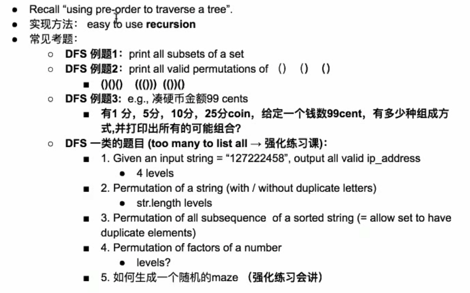

## S.144_Binary Tree Preorder Traversal
```javascript
// Method1: 这种办法需要传一个数组用来存每一层的内容才可以。
function helper(res, root) {
    if (root == null) return;
    res.push(root.val);
    helper(res,root.left);
    helper(res,root.right);
}

var preorderTraversal = function (root) {
    if (root == null || root.length == 0) return [];
    let res = [];
    helper(res,root);
    return res;
};


// Method2: 这个只是在当前层打印出来就好了。
var printPreorderTraversal = function(root) {
    if (root == null) return;
    console.log('root.val', root.val);
    printPreorderTraversal(root.left);
    printPreorderTraversal(root.right);
}
```


## S.145_Binary Tree Postorder Traversal
```javascript
/**
 * time : O(n);
 * space : O(n);
 * @param {TreeNode} root
 * @return {number[]}
 */
function TreeNode(val, left, right) {
    this.val = (val === undefined ? 0 : val)
    this.left = (left === undefined ? null : left)
    this.right = (right === undefined ? null : right)
}

function helper(res, root) {
    if (root == null) return ;
    helper(res,root.left);
    helper(res, root.right);
    res.push(root.val);
}

var postorderTraversal = function(root) {
    let res = [];
    if (root == null || root.length == 0) return res;
    helper(res,root);
    return res;
};
```

## S.94_Binary Tree Inorder Traversal
```javascript
/**
 * 94. Binary Tree Inorder Traversal
 * Given a binary tree, return the inorder traversal of its nodes' values.
 * time : O(n)
 * space : O(n)
 * @param {TreeNode} root
 * @return {number[]}
 */
function helper(res, root) {
    if (root == null) return;
    helper(res,root.left);
    res.push(root.val);
    helper(res,root.right);
}

var inorderTraversal = function(root) {
    let res = [];
    // 此处加 root.length == 0 是因为leetcode里面有一个case: 传进去的值是空array[], 要求返回一个空array.
    if (root == null || root.length == 0) return res;
    helper(res, root);
    return res;
};
```

## S.111_Minimum Depth of Binary Tree
```javascript
/**
 * time : O(n);
 * space : O(n);
 * @param {TreeNode} root
 * @return {number}
 */
var minDepth = function(root) {
    if (root == null) return 0;
    let left = minDepth(root.left);
    let right = minDepth(root.right);
    if (root.left == null || root.right == null) {
        return Math.max(left,right) + 1;
    }
    return 1 + Math.min(left, right);
};
```

## S.104_MaximumDepthofBinaryTree
```javascript
/**
 * 104. Maximum Depth of Binary Tree
 * Given a binary tree, find its maximum depth.

 The maximum depth is the number of nodes along the longest path from the root node down to the farthest leaf node.

 * time : O(n);
 * space : O(n);
 * @param {TreeNode} root
 * @return {number}
 */
var maxDepth = function(root) {
    if (root == null) return 0;
    return 1 + Math.max(maxDepth(root.left),maxDepth(root.right));
};
```


## S.102_Binary Tree Level Order Traversal
```javascript
/**
 *
 * Q102:Given the root of a binary tree, return the level order traversal of its nodes' values. (i.e., from left to right, level by level).
 * Input: root = [3,9,20,null,null,15,7]
 * Output: [[3],[9,20],[15,7]]
 * Definition for a binary tree node.
 * function TreeNode(val, left, right) {
 *     this.val = (val===undefined ? 0 : val)
 *     this.left = (left===undefined ? null : left)
 *     this.right = (right===undefined ? null : right)
 * }
 */
/**
 * @param {TreeNode} root
 * @return {number[][]}
 */
var levelOrder = function (root) {
    if(!root) return [];
    let res = [];
    let queue = [root];
    while (queue.length) {
        let size = queue.length;
        let list = [];
        for (let i = 0; i < size; i++) {
            let cur = queue.shift(); // pick up first element from array
            if (cur.left != null) queue.push(cur.left);
            if (cur.right != null) queue.push(cur.right);
            list.push(cur.val);
        }
        res.push(list);
    }
    return res;
};
```

## S.103_Binary Tree Zigzag Level Order Traversal

```javascript
var zigzagLevelOrder = function (root) {
    if (!root) return [];
    let res = [];
    let queue = [root];
    let x = true;
    while (queue.length != 0) {
        let list = [];
        let size = queue.length;
        for (let i = 0; i < size; i++) {
            let cur = queue.shift();
            if (x) {               // 这一块是需要注意的，非常重要，始终保持左右的顺序，但是插入的顺序可以改成插头或者插尾
                list.push(cur.val);
            } else {
                list.unshift(cur.val);
            }
            if (cur.left != null) queue.push(cur.left);
            if (cur.right != null) queue.push(cur.right);
        }
        x = x ? false : true;
        res.push(list);
    }
    return res;
};
```
## S.107_Binary Tree Level Order Traversal II

```javascript
/* 107. Binary Tree Level Order Traversal II  (102 follow up)
For example:
    Given binary tree [3,9,20,null,null,15,7],
3
/ \
        9  20
/  \
     15   7
    [
    [15,7],
        [9,20],
        [3]
    ]

time : O(n)
space : O(n)
*/
var levelOrderBottom = function(root) {
    if(!root) return [];
    let res = [];
    let queue = [root];
    while (queue.length) {
        let size = queue.length;
        let list = [];
        for (let i = 0; i < size; i++) {
            let cur = queue.shift(); // pick up first element from array
            if (cur.left != null) queue.push(cur.left);
            if (cur.right != null) queue.push(cur.right);
            list.push(cur.val);
        }
        res.unshift(list);
    }
    return res;
};
```


## S.98_Validate Binary Search Tree
```javascript
/**
 * 98. Validate Binary Search Tree
 * Given a binary tree, determine if it is a valid binary search tree (BST).

 Assume a BST is defined as follows:

 The left subtree of a node contains only nodes with keys less than the node's key.
 The right subtree of a node contains only nodes with keys greater than the node's key.
 Both the left and right subtrees must also be binary search trees.

 time : O(n)
 space : O(n)
 *        10 [-inf, +inf]
 *      /       \
 *     5         15
 *   /  \    /         \
 *  2    7  12(10, 15)   20 (15, +inf)
 * @param {TreeNode} root
 * @return {boolean}
 */
function isBSTHelper(root, min, max) {
    if (root == null) return true;
    if (root.val >= max || root.val <= min) {
        return false;
    } else {
        return isBSTHelper(root.left, min, root.val) && isBSTHelper(root.right, root.val, max);
    }
}


var isValidBST = function(root) {
    if (root == null) return true;
    return isBSTHelper(root, -Infinity, Infinity)
};
```
## S.100_Same Tree
```javascript
/**
 * 100. Same Tree

 Given two binary trees, write a function to check if they are equal or not.

 Two binary trees are considered equal if they are structurally identical and the nodes have the same value.

 time : O(n);
 space : O(n);
 * @param {TreeNode} p
 * @param {TreeNode} q
 * @return {boolean}
 */
function check(one,two) {
    if (one == null && two == null) return true;
    if(one == null || two == null)  return false;

    if(one.val != two.val) {
        return false;
    }
    return check(one.left, two.left) && check(one.right, two.right);
}
var isSameTree = function(p, q) {
    if (p == null && q == null) return true;
    return check(p, q);
};

function TreeNode(val, left, right) {
    this.val = (val === undefined ? 0 : val)
    this.left = (left === undefined ? null : left)
    this.right = (right === undefined ? null : right)
}
```
## S.101_Symmetric Tree
```javascript
/**
 * 101. Symmetric Tree
 * Given a binary tree, check whether it is a mirror of itself (ie, symmetric around its center).

 For example, this binary tree [1,2,2,3,4,4,3] is symmetric:
 1
 / \
 2   2
 / \ / \
 3  4 4  3
 * time: O(n)
 * space: O(n)
 * @param {TreeNode} root
 * @return {boolean}
 */
// 这里要注意的就是，如果是one.val == two.val 就要继续向下进行比较。不能直接返回true.
function check(one,two) {
    if (one == null && two == null) return true;

    if(one == null || two == null)  return false;

    if(one.val != two.val) return false;

    return check(one.left, two.right) && check(one.right, two.left);
}
var isSymmetric = function(root) {
    if (root == null) return true;
    return check(root.left, root.right);
};
```

## S.110_Balanced Binary Tree
```javascript
/**
     * 110. Balanced Binary Tree
     * Given a binary tree, determine if it is height-balanced.

     For this problem, a height-balanced binary tree is defined as a binary tree
     in which the depth of the two subtrees of every node never differ by more than 1.
         1  -- 3
        / \
       2   3  -- 1
      / \
     4   5  -- 1

         1
        / \
       2   3  2 --> 3  3 --> 1
      / \
     4   5  -- 2
          \
          9  -- 1

     time : O(n);
     space : O(n);
     * @param root
     * @return
     */

    public boolean isBalanced(TreeNode root) {
        if (root == null) return true;
        return helper(root) != -1;
    }

    public int helper(TreeNode root) {
        if (root == null) return 0;
        int l = helper(root.left);
        int r = helper(root.right);
        if (l == -1 || r == -1 || Math.abs(l - r) > 1) {
            return -1;
        }
        return Math.max(l, r) + 1;
    }
```

## S.108_Convert Sorted Array to Binary Search Tree
```javascript
/* 
* 108. Convert Sorted Array to Binary Search Tree

 [1,2,3,4,5]time: O(n)
 * space: O(n)
 * @param {number[]} nums
 * @return {TreeNode}
 */

function helper(nums, left, right) {
    if (left  > right) return null;
    let mid = left + Math.floor((right - left) / 2);
    let node = new TreeNode(nums[mid]);
    node.left = helper(nums, left, mid-1);
    node.right = helper(nums, mid+1, right);
    return node;
}

var sortedArrayToBST = function(nums) {
    if (nums == null || nums.length == 0) return null;
    return helper(nums, 0, nums.length - 1);
};
```

## S.109_Convert Sorted List to Binary Search Tree
```javascript
/*
* 109. Convert Sorted List to Binary Search Tree

     time : O(nlogn);
     space : O(n);
 */
function toBST(head, tail) {
    if (head == tail) return null;
    let slow = head;
    let fast = head;

    while (fast != tail && fast.next != tail) {
        fast = fast.next.next;
        slow = slow.next;
    }
    let root = new TreeNode(slow.val);
    root.left = toBST(head, slow);
    root.right = toBST(slow.next, tail);
    return root
}


var sortedListToBST = function(head) {
    if (head == null) return null;
    return toBST(head, null);
};
```


## S.133_Clone Graph
```javascript
/**
 * 133. Clone Graph
 * 无向图，深度优先，广度有优先。
 * time : O(m + n) m : nodes n : edges
 * space : O(m)
 * @param {Node} node
 * @return {Node}
 */

// BFS
var cloneGraph = function(node){
    if(!node) return null;
    let map = new Map();
    let queue = [];
    map.set(node, new Node(node.val));
    queue.push(node);
    while (queue.length != 0) {
        let n = queue.shift();
        for (let nei of n.neighbors) {
            if (!map.has(nei)) {
                queue.push(nei);
                map.set(nei, new Node(nei.val));
            }
            map.get(n).neighbors.push(map.get(nei));
        }
    }
    return map.get(node);
};

// DFS 这个暂时还没有看懂
var cloneGraph = function(node, map = new Map()) {
    if(!node) return null
    if(map.has(node)) return map.get(node)
    const n = new Node(node.val)
    map.set(node, n)
    for(let k of node.neighbors){
        n.neighbors.push(cloneGraph(k, map))
    }
    return n;
};
```

##S.199. Binary Tree Right Side View
```javascript
/**
 * Definition for a binary tree node.
 * function TreeNode(val, left, right) {
 *     this.val = (val===undefined ? 0 : val)
 *     this.left = (left===undefined ? null : left)
 *     this.right = (right===undefined ? null : right)
 * }
 */
/**
 *
 * given a binary tree, imagine yourself standing on the right side of it,
 * return the values of the nodes you can see ordered from top to bottom.

 For example:
 Given the following binary tree,
    1            <---
  /   \
 2     3         <---
  \     \
  5     4       <---
 You should return [1, 3, 4].

 root 1 res : 0 level : 1

 res : 1, 3, 4

 time : O(n);
 space : O(n);
 * @param {TreeNode} root
 * @return {number[]}
 */

function TreeNode(val, left, right) {
    this.val = (val === undefined ? 0 : val)
    this.left = (left === undefined ? null : left)
    this.right = (right === undefined ? null : right)
}

// Method 1 - DFS
function helper(res, root, level) {
    if (root == null) return;
    if (res.length == level) {
        res.push(root.val);
    }
    helper(res, root.right, level + 1);
    helper(res, root.left, level + 1);
}

var rightSideView = function (root) {
    let res = [];
    helper(res, root, 0);
    return res;
};


// Method 2 - BFS
var rightSideView = function (root) {
    if (!root) return [];
    let res = [];
    let queue = [root];
    while (queue.length) {
        let size = queue.length;
        for (let i = 0; i < size; i++) {
            let cur = queue.shift();
            if (i == 0) res.push(cur.val);
            if (cur.right != null) queue.push(cur.right);
            if (cur.left != null) queue.push(cur.left);

        }
    }
    return res;
};

let root = new TreeNode(3);
let node1 = new TreeNode(9);
let node2 = new TreeNode(20);
root.left = node1;
root.right = node2;

console.log(rightSideView(root));
```

##S.958. Check Completeness of a Binary Tree
```javascript
/**
 * Given the root of a binary tree, determine if it is a complete binary tree.
 * Definition for a binary tree node.
 * function TreeNode(val, left, right) {
 *     this.val = (val===undefined ? 0 : val)
 *     this.left = (left===undefined ? null : left)
 *     this.right = (right===undefined ? null : right)
 * }
 */
/**
 * @param {TreeNode} root
 * @return {boolean}
 */
function TreeNode(val, left, right) {
    this.val = (val === undefined ? 0 : val)
    this.left = (left === undefined ? null : left)
    this.right = (right === undefined ? null : right)
}
// Method 1
var isCompleteTree = function (root) {
    if (root == null) return false;
    let queue = [root];
    // 加上这一行就不对了,要非常注意。
    // let size = queue.length;
    let flag = false;
    while (queue.length) {
        let cur = queue.shift();
        // case 1: 左边为空，右边不为空。肯定不对
        if (cur.left == null && cur.right != null) return false;
        // case 2: 左边不是空，右边是空。先判断flag, 然后判断要是还有新的node就不对。在push.
        if (cur.left != null && cur.right == null) {
            if (flag == true) {
                return false;
            }
            queue.push(cur.left);
            flag = true;
        }
        // case 3: 同时都为空，就把flag给改了。
        if (cur.left == null && cur.right == null) {
            flag = true;
        }
        // case 4: 同时都不是空，先判断flag,在push.
        if (cur.left != null && cur.right != null) {
            if (flag == true) {
                return false;
            }
            queue.push(cur.left);
            queue.push(cur.right);
        }
    }
    return true;
};

// Method 2:  T.C: O(N)， S.C: O(N)
// 这种情况比较特殊。就是一直push.直到出现null。stop。如果还有node && node != null。就不对。
var isCompleteTree2 = function(root) {
    let queue = [];
    queue.push(root);
    while (queue.length) {
        let cur = queue.shift();
        if (cur == null) {
            break;
        }
        queue.push(cur.left);
        queue.push(cur.right);
    }

    while (queue.length) {
        let cur = queue.shift();
        if (cur != null) {
            return false;
        }
    }
    return true;
};
```
## S.785_Is Graph Bipartite?
```javascript
/**
 * @param {number[][]} graph
 * @return {boolean}
 */
var isBipartite = function (graph) {
    const n = graph.length;
    const visited = Array(n).fill(0);

    for (let i = 0; i < n; i++) {
        if (visited[i] == 0) {
            let queue = [i];
            visited[i] = 1;
            while (queue.length) {
                const curr = queue.shift();
                for (let nei of graph[curr]) {
                    if (visited[nei] === visited[curr]) {
                        return false;
                    }
                    if (visited[nei] == 0) {
                        visited[nei] = -visited[curr];
                        queue.push(nei);
                    }
                }
            }
        }
    }
    return true;
};
```

## S.207. Course Schedule
```javascript
/**
 * 207. Course Schedule
 * There are a total of n courses you have to take, labeled from 0 to n - 1.

 Some courses may have prerequisites, for example to take course 0 you have to first take course 1,
 which is expressed as a pair: [0,1]

 Given the total number of courses and a list of prerequisite pairs, is it possible for you to finish all courses?

 For example:

 2, [[1,0]]
 There are a total of 2 courses to take. To take course 1 you should have finished course 0. So it is possible.

 2, [[1,0],[0,1]]
 There are a total of 2 courses to take. To take course 1 you should have finished course 0,
 and to take course 0 you should also have finished course 1. So it is impossible.

 time : O(V + E)
 space : O(n)
 思路： BFS
 * @param {number} numCourses
 * @param {number[][]} prerequisites
 * @return {boolean}
 */
var canFinish = function(numCourses, prerequisites) {
    // 当前这门课需要几个前置课，indegree[] => key: pair[0] 课程， value：几个前置课
    let indegree = new Array(numCourses).fill(0);
    let res = numCourses;
    for (let pair of prerequisites) {
        indegree[pair[0]]++;
    }

    // 找到进入的课程，就是不需要先修课程的课，放到queue里面去
    let queue = [];
    for (let i = 0; i < indegree.length; i++) {
        if (indegree[i] == 0) {
            queue.push(i);
        }
    }

    // queue拿出来，计算个数。 res最后看是不是0，是的话就是可以了。
    while (queue.length != 0) {
        // pre => 表示可以修的课程
        let pre = queue.shift();
        res--;
        for (let pair of prerequisites) {
            // pair[1] => 表示需要先修的课程，如果已经有了，就把 indegree[pair[0]]--； 最后在判断是不是0，是的话就放到queue里面去。
            if (pair[1] == pre) {
                indegree[pair[0]]--;
                if (indegree[pair[0]] == 0) {
                    queue.push(pair[0]);
                }
            }
        }
    }
    return res == 0;
};
```

## S.210. Course Schedule II
```javascript
/**
 * 210. Course Schedule II
 * There are a total of n courses you have to take, labeled from 0 to n - 1.

 Some courses may have prerequisites, for example to take course 0 you have to first take course 1,
 which is expressed as a pair: [0,1]

 Given the total number of courses and a list of prerequisite pairs, return the resing of courses you should
 take to finish all courses.

 There may be multiple correct ress, you just need to return one of them. If it is impossible to finish all courses,
 return an empty array.

 For example:

 2, [[1,0]]
 There are a total of 2 courses to take. To take course 1 you should have finished course 0. So the correct course res
 is [0,1]

 4, [[1,0],[2,0],[3,1],[3,2]]
 There are a total of 4 courses to take. To take course 3 you should have finished both courses 1 and 2.
 Both courses 1 and 2 should be taken after you finished course 0. So one correct course res is [0,1,2,3].
 Another correct resing is[0,2,1,3].


   -> 1 ->
 0         3
   -> 2 ->


 入度 = 0 => BFS

 0 : 0
 1 : 0
 2 : 0
 3 : 2

 queue : 3
 res : 0,1,2,3

 time : O(V + E)
 space : O(n)
 思路：BFS
 * @param {number} numCourses
 * @param {number[][]} prerequisites
 * @return {number[]}
 */
var findOrder = function(numCourses, prerequisites) {
    let indegree = new Array(numCourses).fill(0);
    let res = new Array(numCourses);
    let k = 0;
    for (let pair of prerequisites) {
        indegree[pair[0]]++;
    }
    let queue = [];
    for (let i = 0; i < indegree.length; i++) {
        if (indegree[i] == 0) {
            queue.push(i);
            res[k++] = i;
        }
    }

    while (queue.length != 0) {
        let pre = queue.pop();
        for (let pair of prerequisites) {
            if (pair[1] == pre) {
                indegree[pair[0]]--;
                if (indegree[pair[0]] == 0) {
                    queue.push(pair[0]);
                    res[k++] = pair[0];
                }
            }
        }
    }
    return (k == numCourses) ? res : [];
};

let course = [[1,0],[2,0],[3,1],[3,2]];

console.log(findOrder(4,course));
```

## S.222. Count Complete Tree Nodes
```javascript
/**
 * 222. Count Complete Tree Nodes
 * Given a complete binary tree, count the number of nodes.

 Definition of a complete binary tree from Wikipedia:
 In a complete binary tree every level, except possibly the last, is completely filled, and all nodes
 in the last level are as far left as possible. It can have between 1 and 2h nodes inclusive at the last level h.

       3
     /   \
    9     20
  /  \   /  \
 15   7 1

 2^h - 1

 * @param {TreeNode} root
 * @return {number}
 */
// Method 1: time: O(n), space: O(1)
var countNodes = function(root) {
    if (root == null) return 0;
    let count = 0;
    let queue = [root];
    while (queue.length != 0) {
        let size = queue.length;
        for (let i = 0; i < size; i++) {
            let cur = queue.shift();
            count++;
            if (cur.left != null) queue.push(cur.left);
            if (cur.right != null) queue.push(cur.right);
        }
    }
    return count;
};

// Method 2
// time : O(logn * logn)
// space : O(n) / O(logn) 不确定
function leftDepth(root) {
    let height = 0;
    while (root != null) {
        root = root.left;
        height++;
    }
    return height;
}

function rightDepth(root) {
    let height = 0;
    while (root != null) {
        root = root.right;
        height++;
    }
    return height;
}

var countNodes = function(root) {
    let left = leftDepth(root);
    let right = rightDepth(root);

    if (left == right) {
        return (1 << left) - 1
    } else {
        return 1 + countNodes(root.left) + countNodes(root.right);
    }
};
```

## S.230. Kth Smallest Element in a BST
```javascript
/**
 * 230. Kth Smallest Element in a BST
 * Given a binary search tree, write a function kthSmallest to find the kth smallest element in it.
 *
 *
 * time : O(n)
 * space : O(n);
 * @param {TreeNode} root
 * @param {number} k
 * @return {number}
 */
function TreeNode(val, left, right) {
    this.val = (val === undefined ? 0 : val)
    this.left = (left === undefined ? null : left)
    this.right = (right === undefined ? null : right)
}

function helper(root, inorder) {
    if (root == null) return;
    helper(root.left, inorder);
    inorder.push(root.val);
    helper(root.right, inorder);
}

var kthSmallest = function(root, k) {
    let inorder = []
    helper(root, inorder);
    return inorder[k-1];
};

let root = new TreeNode(3);
let node1 = new TreeNode(1);
let node2 = new TreeNode(4);
let node3 = new TreeNode(2);

root.left = node1;
root.right = node2;
node1.left = null;
node1.right = node3;
node2.left = null;
node2.right = null
console.log(kthSmallest(root, 1)); // 1
```

## S.378. Kth Smallest Element in a Sorted Matrix
```javascript
/**
 * 378. Kth Smallest Element in a Sorted Matrix
 * Given an n x n matrix where each of the rows and columns are sorted in ascending order, return the kth smallest element in the matrix.
 * Note that it is the kth smallest element in the sorted order, not the kth distinct element.
 * Input: matrix = [[1,5,9],[10,11,13],[12,13,15]], k = 8
 * Output: 13
 * Explanation: The elements in the matrix are [1,5,9,10,11,12,13,13,15], and the 8th smallest number is 13
 * @param {number[][]} matrix
 * @param {number} k
 * @return {number}
 */
// Method 1:
var kthSmallest = function (matrix, k) {
    return matrix.flatMap(x => x).sort((a, b) => a - b)[k - 1]
};
let matrix = [[1,5,9],[10,11,13],[12,13,15]]
console.log(kthSmallest(matrix, 8))


// Method 2:
var singleArray = function(arr) {
    let size = arr.length;
    let oneDarray = [];
    for(let i = 0; i< size; i++) {
        oneDarray.push(...arr[i]);
    }
    return oneDarray;
}
```

## S.250. Count Univalue Subtrees
```javascript
/**
 * 250. Count Univalue Subtrees
 * Given a binary tree, count the number of uni-value subtrees.

 A Uni-value subtree means all nodes of the subtree have the same value.

 For example:
 Given binary tree,
      5
     / \
    1   5
   / \   \
  5   5   5
 return 4.

 root = 5 res = 2
 root = 1
 root = 5 res = 3
 root = 5 res = 4

 time : O(n)
 space : O(n)
 * Definition for a binary tree node.
 * function TreeNode(val, left, right) {
 *     this.val = (val===undefined ? 0 : val)
 *     this.left = (left===undefined ? null : left)
 *     this.right = (right===undefined ? null : right)
 * }
 */
/**
 * @param {TreeNode} root
 * @return {number}
 */
var countUnivalSubtrees = function(root) {
    let res = 0;
    helper(root);
    return res;
    function helper(root) {
        if (root == null) return true;
        let left = helper(root.left);
        let right = helper(root.right);
        if (left && right) {
            if (root.left != null && root.left.val != root.val) {
                return false;
            }

            if (root.right != null && root.right.val != root.val) {
                return false;
            }

            res++;
            return true;
        }
    }
};
```
##S.257. Binary Tree Paths
```javascript
/**
 * 257. Binary Tree Paths
 * Given a binary tree, return all root-to-leaf paths.

 For example, given the following binary tree:
 3
 / \
 9  20
 /  \
 15   7
 ["3->9->15", "3->9->7", "3->20]

 case :
 3
 / \
 9  20
 /  \
 15   7
 3->9->15
 3->9->7
 3->20
 ["3->9->15", "3->9->7", "3->20]

 time : O(n);
 space : O(n);
 * @param {TreeNode} root
 * @return {string[]}
 */

function helper(res,root, path) {
    if (root.left == null && root.right == null) {
        res.push(path + root.val);
    }
    if (root.left != null) {
        helper(res, root.left, path + root.val + "->");
    }
    if (root.right != null) {
        helper(res, root.right, path + root.val + "->");
    }
}

var binaryTreePaths = function(root) {
    let res = [];
    if (root == null) return res;
    helper(res,root, "");
    return res;
};

function TreeNode(val, left, right) {
    this.val = (val === undefined ? 0 : val)
    this.left = (left === undefined ? null : left)
    this.right = (right === undefined ? null : right)
}

let n1 =  new TreeNode(1);
let n2 =  new TreeNode(2);
let n3 =  new TreeNode(3);
let n4 =  new TreeNode(5);
n1.left = n2;
n1.right = n3;
n2.right = n4;

console.log(binaryTreePaths(n1)); // [ '1->2->5', '1->3' ]
```