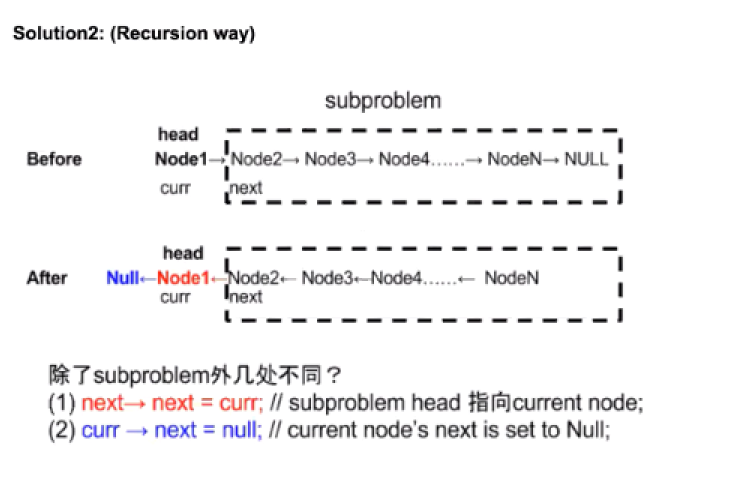
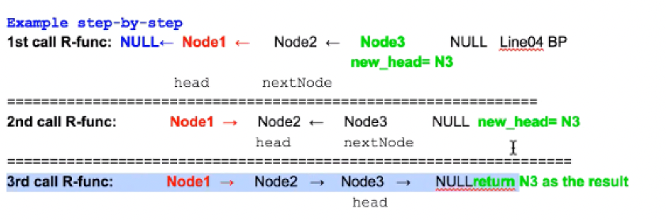
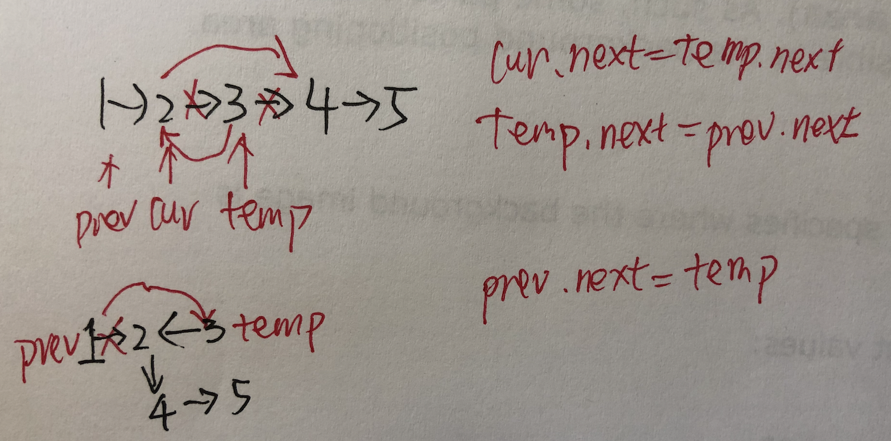
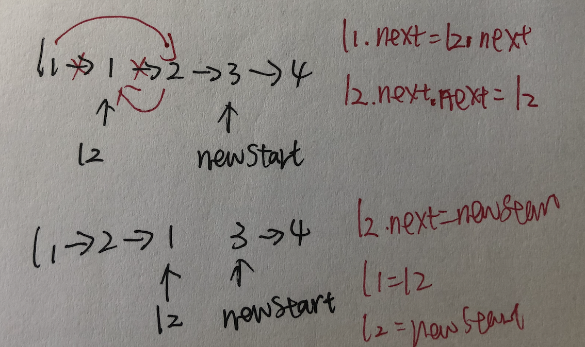
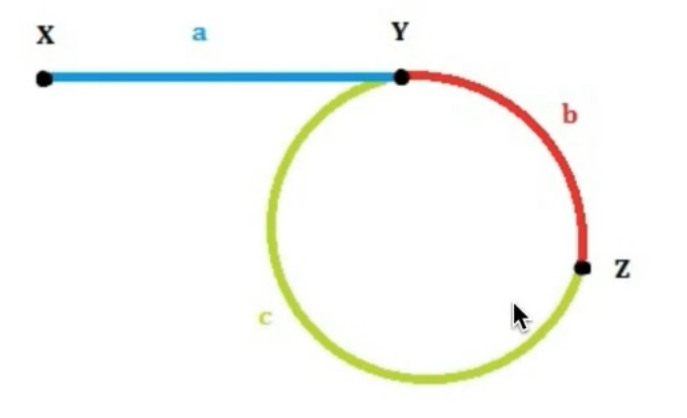

# Leetcode刷题笔记（链表部分）

[TOC]
https://github.com/gaochengcheng/LeetCode/blob/master/Leetcode%E5%88%B7%E9%A2%98%E7%AC%94%E8%AE%B0%EF%BC%88%E9%93%BE%E8%A1%A8%E9%83%A8%E5%88%86%EF%BC%89.md


## S.2_Add Two Numbers

原题地址：https://leetcode.com/problems/add-two-numbers/

思路：

(2 -> 4 -> 3) + (5 -> 6 -> 4) Output: 7 -> 0 -> 8。其中，对243而言，2是个位，4是十位，3是百位。对564而言，5是个位，6是十位，4是百位。

按照做加法的方式写，对应为相加然后判断是否需要进位。

代码：

```javascript
var addTwoNumbers = function(l1, l2) {
    let dummy = new ListNode(-1);
    let cur = dummy;
    let p1 = l1;
    let p2 = l2;
    let sum = 0;

    while (p1 != null || p2 != null) {
        if (p1 != null) {
            sum += p1.val;
            p1 = p1.next;
        }

        if (p2 != null) {
            sum += p2.val;
            p2 = p2.next;
        }
        cur.next = new ListNode(sum % 10);
        sum = Math.floor(sum / 10);
        cur = cur.next;
    }
    if (sum == 1) {
        cur.next = new ListNode(1)
    }
    return dummy.next;
};
```


## S.206_Reverse Linked List

原题地址：https://leetcode.com/problems/reverse-linked-list/#/description

思路：常考题型



代码：

```javascript
function ListNode(val, next) {
    this.val = (val === undefined ? 0 : val)
    this.next = (next === undefined ? null : next)
}

// Method 1 recursion
var reverseList = function (head) {
    if (head == null || head.next == null) {
        return head;
    }

    let pre = null;
    let cur = head;
    while (cur != null) {
        let next = cur.next;
        cur.next = pre;
        pre = cur;
        cur = next;
    }
    return pre;
};

// Method 2 recursion
var reverseList = function (head) {
    if (head == null || head.next == null) {
        return head;
    }

    let new_head = reverseList(head.next);
    head.next.next = head;
    head.next = null;
    return new_head;
};
```

## S_merge two sorted linkedList
## S.21_Merge Two Sorted Lists
```javascript
/* Merge two sorted linked lists and return it as a new list. The new list should be made
 * by splicing together the nodes of the first two lists.

 time : O(n);
 space : O(n);
/**
 * @param {ListNode} l1
 * @param {ListNode} l2
 * @return {ListNode}
 */


function ListNode(val, next) {
    this.val = (val === undefined ? 0 : val)
    this.next = (next === undefined ? null : next)
}

var mergeTwoLists = function(l1, l2) {
    let dummy = new ListNode(0);
    let cur = dummy;
    while (l1 != null && l2 != null) {
        if (l1.val < l2.val) {
            cur.next = l1;
            cur = cur.next;
            l1 = l1.next;
        } else {
            cur.next = l2;
            cur = cur.next;
            l2 = l2.next;
        }
    }

    if (l1 != null) {
        cur.next = l1;
    }

    if (l2 != null) {
        cur.next = l2;
    }

    return dummy.next;
};
```

## S.328_Odd Even Linked List 
```javascript
var oddEvenList = function(head) {
    if (head == null) return head;
    let dummyHeadOdd = new ListNode();
    let dummyHeadEven = new ListNode();
    let curOdd = dummyHeadOdd;
    let curEven = dummyHeadEven;
    let cur = head;
    let idx = 1;

    while (cur != null) {
        if (idx % 2 === 1) {
            curOdd.next = cur;
            curOdd = curOdd.next;
        } else {
            curEven.next = cur;
            curEven = curEven.next;
        }
        cur = cur.next;
        idx++;
    }
    curOdd.next = dummyHeadEven.next;
    curEven.next = null;
    return dummyHeadOdd.next;
};
```

## S.92_Reverse Linked List II（思路巧妙）

原题地址：https://leetcode.com/problems/reverse-linked-list-ii/

思路：

代码：

```javascript
 /*For example:
 Given 1->2->3->4->5->NULL, m = 2 and n = 4,

 return 1->4->3->2->5->NULL.

 1->2->3->4->5
 p  c  t
 视频解释： https://www.youtube.com/watch?v=wk8-_M-2fzI

 time : O(n);
 space : O(1);
 * @param {ListNode} head
 * @param {number} left
 * @param {number} right
 * @return {ListNode}
 */

const reverseBetween = (head, left, right) => {
    const dummy = new ListNode(0);
    dummy.next = head;

    let pre = dummy;
    let cur = head;
    for (let i = 1; i < left; i++) {
        pre = pre.next;
        cur = cur.next;
    }

    // 这一段是最难的部分
    for (let i = 0; i < right - left; i++) {
        let temp = cur.next;
        cur.next = temp.next;
        temp.next = pre.next;
        pre.next = temp;
    }
    return dummy.next;
};
```

## S.86_Partition List

原题地址：https://leetcode.com/problems/partition-list/

思路：

这道题的意思就是说，给定一个值x，小于x的都放到大于等于x的前面。并且不改变链表之间node原始的相对位置。

1. new两个新链表，一个用来管理所有大于等于x的数，一个用来管理小于x的数。遍历原来的链表时，当当前node.val大于等于x就接在大链表上，当当前node.val小于x，就接在小链表上。
2. 最后把小链表的最后一个接上大链表的第一个，大链表最后一个元数的next设置为null。

代码：

```javascript
 /* 
 86. Partition List
 * Given a linked list and a value x, partition it such that all nodes less than x come before nodes
 * greater than or equal to x.

 You should preserve the original relative order of the nodes in each of the two partitions.

 For example,
 Given 1->4->3->2->5->2 and x = 3,
 return 1->2->2->4->3->5.


 1->4->3->2->5->2 and x = 3
 smallHead -> 1 -> 2 -> 2 ->
 small
 bigHead -> 4 -> 3 -> 5 ->
 big

 time : O(n)
 space : O(n)
 */

var partition = function(head, x) {
    if (head == null) return head;
    let dummyHeadSmall = new ListNode();
    let dummyHeadBig = new ListNode();
    let curSmall = dummyHeadSmall;
    let curBig = dummyHeadBig;
    let cur = head;

    while (cur != null) {
        if (cur.val < x) {
            curSmall.next = cur;
            curSmall = curSmall.next;
        } else {
            curBig.next = cur;
            curBig = curBig.next;
        }
        cur = cur.next;
    }
    curBig.next = null;
    curSmall.next = dummyHeadBig.next;
    return dummyHeadSmall.next;
};
```

# S-insert a node in linkedList
## S.237_Delete Node in a Linked List
```javascript
var deleteNode = function(node) {
    node.val = node.next.val;
    node.next = node.next.next;
};

```

## 234_Palindrome Linked List
```javascript
function findMiddle(head) {
    let slow = head;
    let fast = head;
    while(fast.next != null && fast.next.next != null) {
        slow = slow.next;
        fast = fast.next.next;
    }
    return slow;
}


function reverse(head) {
    if (head == null || head.next == null) return head;
    let pre = null;
    let cur = head;
    while(cur != null) {
        let next = cur.next;
        cur.next = pre;
        pre = cur;
        cur = next;
    }
    return pre;
}
var isPalindrome = function(head) {
    let middleNode = findMiddle(head);
    middleNode.next = reverse(middleNode.next);
    let q = head;
    let p = middleNode.next;
    while(q != null && p != null) {
        if (p.val != q.val) return false;
        p = p.next;
        q = q.next;
    }
    return true;
};
```
## S.203_Remove LinkedList element

```javascript
function ListNode(val, next) {
    this.val = (val === undefined ? 0 : val)
    this.next = (next === undefined ? null : next)
}

var removeElements = function(head, val) {
    if (head == null) return head;
    let dummy = new ListNode(0);
    dummy.next = head;
    let prev = dummy;
    while (prev != null && prev.next != null) {
        if (prev.next.val != val) {
            prev = prev.next;
        } else {
            prev.next = prev.next.next;
        }
    }

    return dummy.next;
};
```


## S.83_Remove Duplicates from Sorted List

原题地址：https://leetcode.com/problems/remove-duplicates-from-sorted-list/

思路：

这道题目吧，本质上就是在一个已经排过序的链表中，对元素进行遍历操作，当发现链表中有重复元素的时候，通过修改链表指针达到删除重复元素的效果。

1. 一旦发现有相同的`p.val == p.next.val`就用 while循环。 一直找到下一个不一样的。
2. 但是要注意 `p.next != null`.没有这个直接 `p.next.val == sameVal`会出错的。


代码：

```javascript
var deleteDuplicates = function(head) {
    if (head ==null || head.next == null) return head;
    let dummy = new ListNode();
    dummy.next = head;
    let p = head;
    while (p.next != null) {
        if (p.val == p.next.val) {
            let sameVal = p.val;
            // 注意这里p.next != null;
            while (p.next != null && p.next.val == sameVal) {
                p.next = p.next.next;
            }
        }
        p = p.next;
    }
    return dummy.next;
};
```

## S.82_Remove Duplicates from Sorted List II

原题地址：https://leetcode.com/problems/remove-duplicates-from-sorted-list-ii/

思路：

这个题目和上面一个题目很相似，不同之处在于，一旦遇到重复元素，就把该元素全部删除掉。

最开始建立头结点，并将其.next指向head。
```javascript
let dummy = new ListNode();
dummy.next = head;
let p = dummy;
```

```javascript
p.next != null && p.next.next != null
```

代码：

```javascript
/**
 * 82. Remove Duplicates from Sorted List II (83. Remove Duplicates from Sorted List: follow up)
 * Given a sorted linked list, delete all nodes that have duplicate numbers, leaving only distinct numbers from the original list.

 For example,
 Given 0->1->2->3->3->4->4->5, return 1->2->5.
 Given 0->1->1->1->2->3, return 2->3.
 time : O(n);
 space : O(1);
 * @param {ListNode} head
 * @return {ListNode}
 */
var deleteDuplicates = function(head) {
    if (head == null || head.next == null) return head;
    let dummy = new ListNode();
    dummy.next = head;
    let p = dummy;
    while(p.next != null && p.next.next != null) {
        if (p.next.val == p.next.next.val) {
            let sameVal = p.next.val;
            while(p.next != null&& p.next.val == sameVal) {
                p.next = p.next.next;
            }
        }else {
            p = p.next;
        }
    }
    return dummy.next;
};
```

## S.61_Rotate List

原题地址：https://leetcode.com/problems/rotate-list/

思路：

这道题主要先理解题意，就是倒着数k个node，从那开始到结尾和之前那部分对调，那个例子就是，4->5拿前面来，1->2->3拿后面去。

几个特殊：

1).k是可以大于整个list的长度的，所以这时要对k对len取模

2).如果取模之后得0，`i < count - k % count`，又回到了head.

代码：

```javascript
var rotateRight = function(head, k) {
    if(head == null || head.next == null) return head;

    let count = 1;
    let tail = head;
    // 收尾相连十分的巧妙。 k % len === 0.就不用单独讨论了！！！
    while (tail.next != null) {
        tail = tail.next;
        count++;
    }
    tail.next = head;
    for (let i = 1; i < count - k % count; i++) {
        head = head.next;
    }
    let newHead = head.next;
    head.next = null;
    return newHead;
};
```

## S.24_Swap Nodes in Pairs

原题地址：https://leetcode.com/problems/swap-nodes-in-pairs/

思路：

使用两个指针，分别指向相邻的两个元素，然后交换两个元素的值。

交换元素之后，两个指针分别同时向后移动，重复之前的操作。


代码：
 
```javascript
/* 
* * Given a linked list, swap   every two adjacent nodes and return its head.

For example,
Given 1->2->3->4, you should return the list as 2->1->4->3.

time : O(n);
space : O(1);
* @param {ListNode} head
* @return {ListNode}
*/

var swapPairs = function(head) {
   if (head == null || head.next == null) return head;
   let dummy = new ListNode(0);
   dummy.next = head;
   let l1 = dummy;
   let l2 = head;
   while (l2 != null && l2.next != null) {
      let newStart = l2.next.next;
      l1.next = l2.next;
      l2.next.next = l2;
      l2.next = newStart;
      l1 = l2;
      l2 = l2.next;
   }
   return dummy.next;
};
```
## S.160. Intersection of Two Linked Lists
第二种方法很有意思！！
```javascript
/**
 * 160. Intersection of Two Linked Lists
 * For example, the following two linked lists:

 A:          a1 → a2
                    ↘
                        c1 → c2 → c3
                    ↗
 B:     b1 → b2 → b3
 begin to intersect at node c1.

 time : O(n);
 space : O(1);
 * @param {ListNode} headA
 * @param {ListNode} headB
 * @return {ListNode}
 */

function len(head) {
    let len = 1;
    while (head != null) {
        head = head.next;
        len++;
    }
    return len;
}
// Method 1
var getIntersectionNode = function(headA, headB) {
    if (headA == null || headB == null) return null;
    let lenA = len(headA);
    let lenB = len(headB);

    if (lenA > lenB) {
        while (lenA != lenB) {
            headA = headA.next;
            lenA--;
        }
    } else {
        while (lenA != lenB) {
            headB = headB.next;
            lenB--;
        }
    }

    while (headA != headB) {
        headA = headA.next;
        headB = headB.next;
    }
    return headA;
};

/**
 *
 A:          a1 → a2
                    ↘
                         c1 → c2 → c3
                    ↗
 B:     b1 → b2 → b3
 begin to intersect at node c1.

 A : a1 → a2 -> c1 → c2 → c3 -> b1 → b2 → b3 -> c1 → c2 → c3
 B : b1 → b2 → b3 -> c1 → c2 → c3 -> a1 → a2 -> c1 → c2 → c3

 time : O(m + n);
 space : O(1);

 * @param headA
 * @param headB
 * @return
 */
// Method 2

var getIntersectionNode = function(headA, headB) {
    if (headA == null || headB == null) return null;
    let a = headA;
    let b = headB;
    while (a != b) {
       a = a == null ? headB : a.next;
       b = b == null ? headA : b.next;
    }
    return a;
};

```


## S.138_Copy List with Random Pointer（hard）

原题地址：https://leetcode.com/problems/copy-list-with-random-pointer/

思路 两步走：

1.第一步通过next指针遍历所有元素，先把所有节点创建出来，使用next指针把他们之间的关系连接上。并且再此过程中，把值相同的节点放到map中，key是旧链接的节点，value是新链接的节点。他们的lable值相同。

2.第二步，通过next指针再次遍历元素，依次把每个元素的random指向的节点取出来，赋给新链接的random。

最后返回新链接的头结点`map.get(head)`，就OK啦。

代码：

```javascript
/**
 * 138. Copy List with Random Pointer
 * A linked list is given such that each node contains an additional random pointer which could
 * point to any node in the list or null.

 Return a deep copy of the list
 讲解视频： https://www.youtube.com/watch?v=UWt3qmjx8qo
 特别要注意的是这里的null!!!!!! => new Node(cur.val, null, null);
 time : O(n);
 space : O(n);
 * @param {Node} head
 * @return {Node}
 */
function Node(val, next, random) {
    this.val = val;
    this.next = next;
    this.random = random;
};

var copyRandomList = function (head) {
    if (!head) return head;
    let map = new Map();
    let cur = head;
    while (cur != null) {
        map.set(cur, new Node(cur.val, null, null));
        cur = cur.next;
    }

    cur = head;
    while (cur != null) {
        map.get(cur).next = cur.next !== null ? map.get(cur.next) : null;
        map.get(cur).random = cur.random !== null ? map.get(cur.random) : null;
        cur = cur.next;
    }
    return ;
};
```

## S.141_Linked List Cycle

原题地址：https://leetcode.com/problems/linked-list-cycle/

思路： 设置两个指针slow和faster，slow指针每次向后移动一个位置，faster每次向后移动两个指针。如果这个链表中存在环，那么这两个指针肯定会有相遇的时候。

代码：

```javascript
var hasCycle = function(head) {
    if (head == null) return false;
    let slow = head;
    let fast = head;
    while(fast != null && fast.next != null) {
        slow = slow.next;
        fast = fast.next.next;
        if (fast == slow) {
            return true;
        }
    }
    return false;
};
```

## S.142_Linked List Cycle II（medium）

原题地址：https://leetcode.com/problems/linked-list-cycle-ii/

**思路：第一次相遇之后，一个指针重置，然后继续走，再次相遇的点就是入环点！！**

第一次相遇slow距离: a + b, fast距离: a + b + c + b。 

因为fast是slow速度的两倍。so: 2 (a+b) = a + b + c + b。 => a = c  

在z处相遇。 a = c;




代码：

```javascript
var detectCycle = function (head) {
    if (head == null || head.next == null) return null;
    let slow = head;
    let fast = head;

    while (fast.next != null && fast.next.next != null) {
        slow = slow.next;
        fast = fast.next.next;
            if (fast == slow) {
                let slow2 = head;
                while(slow != slow2) {
                    slow = slow.next;
                    slow2 = slow2.next;
                }
                return slow;
            }
        }
        return null;
};
```

## S.143_Reorder List（medium，重点）

原题地址：https://leetcode.com/problems/reorder-list/

思路： 把【1，2，3，4】分成两部分，【1，2】和【3，4】，第二部分逆序，成为【4，3】，然后顺次连接两个链表，最后结果：【1，4，2，3】。

**技巧**：在求中间元素的时候，不需要先遍历一遍求出长度，然后再次遍历到中间找到中间元素。只需要搞两个指针，slower和faster，slower每次走一步，faster每次走两步，当faster到达末尾的时候，slower走过的路正好是faster走过的一半，所以slower.next就是第二部分的第一个元素。

1. 第一个链表和第二个链表分开.
2. 把第二部分元素逆序了.
3. 把两个链表按序接起来.

代码：

```javascript
/*
 * 143. Reorder List
 * Given a singly linked list L: L0→L1→…→Ln-1→Ln,
 reorder it to: L0→Ln→L1→Ln-1→L2→Ln-2→…

 You must do this in-place without altering the nodes' values.

 For example,
 Given {1,2,3,4}, reorder it to {1,4,2,3}.

 time : O(n)
 space : O(1)
 * @param {ListNode} head
 * @return {void} Do not return anything, modify head in-place instead.
 */
function ListNode(val, next) {
     this.val = (val===undefined ? 0 : val)
     this.next = (next===undefined ? null : next)
}

function findMiddle(head) {
    let slow = head;
    let fast = head;
    while (fast.next != null && fast.next.next != null) {
        slow = slow.next;
        fast = fast.next.next;
    }
    return slow;
}

function reverseNode(head) {
    if (head == null || head.next == null) return head;
    let pre = null;
    let cur = head;
    while(cur != null) {
        let nextNode = cur.next;
        cur.next = pre;
        pre = cur;
        cur = nextNode;
    }
    return pre;
}

function mergeList(l1, l2) {
    if (l1 == null && l2 == null) return null;
    let dummy = new ListNode(0);
    let cur = dummy;

    while (l1 != null && l2 != null) {
        cur.next = l1;
        l1 = l1.next;
        cur.next.next = l2;
        l2 = l2.next;
        cur = cur.next.next;
    };

     if (l1 != null) {
        cur.next = l1;
    };

    if (l2 != null) {
        cur.next = l2;
    };
    return dummy.next;
}

var reorderList = function(head) {
    if (head == null || head.next == null) return head;
    let mid = findMiddle(head);
    let one = head;
    let two = mid.next;
    mid.next = null;
    let new_head = reverseNode(two);
    return mergeList(one,new_head);
};

function print(head) {
    while (head != null){
        console.log(head.val);
        head = head.next;
    }
}
```
## S.147_Insertion Sort List

```javascript
/**
 * 147. Insertion Sort List
 * time : O(n^2)
 * space : O(1)
 * @param {ListNode} head
 * @return {ListNode}
 */
function ListNode(val, next) {
    this.val = (val === undefined ? 0 : val)
    this.next = (next === undefined ? null : next)
}

var insertionSortList = function (head) {
    if (head == null || head.next == null) return head;
    let dummy = new ListNode(-1);
    dummy.next = head;
    let prev = null;
    let temp = null;
    let cur = head;
    while (cur != null && cur.next != null) {
        if (cur.val <= cur.next.val) {
            cur = cur.next;
        } else {
            prev = dummy;
            temp = cur.next;
            cur.next = temp.next;

            while (prev.next.val <= temp.val) {
                prev = prev.next;
            }
            temp.next = prev.next;
            prev.next = temp;
        }
    }
    return dummy.next;
};
```

## 148_Sort List

```javascript
/* 148. Sort List
   Given the head of a linked list, return the list after sorting it in ascending order.

   Follow up: Can you sort the linked list in O(n logn) time and O(1) memory (i.e. constant space)?

 * Sort a linked list in O(n log n) time using constant space complexity.
 *  很重要=》比较难理解的是 line: 60 =》 return merge(sortList(one), sortList(two));
 * time : O(nlogn)
 * space : O(n)
 * @param {ListNode} head
 * @return {ListNode}
 * */
function ListNode(val, next) {
    this.val = (val === undefined ? 0 : val)
    this.next = (next === undefined ? null : next)
}

function findMiddle(head) {
    if (head == null || head.next == null) return head;
    let slow = head;
    let fast = head;
    while (fast.next != null && fast.next.next != null) {
        slow = slow.next;
        fast = fast.next.next;
    }
    return slow;
}

function merge(l1, l2) {
    let dummy = new ListNode(-1);
    let cur = dummy;
    while (l1 != null && l2 != null) {
        if (l1.val <= l2.val) {
            cur.next = l1;
            l1 = l1.next;
        } else {
            cur.next = l2;
            l2 = l2.next;
        }
        cur = cur.next;
    }
    if (l1 != null) {
        cur.next = l1;
    } else {
        cur.next = l2;
    }
    return dummy.next;
}

var sortList = function(head) {
    if (head == null || head.next == null) return head;
    let middle = findMiddle(head);
    let two = middle.next;
    let one = head;
    middle.next = null;
    return merge(sortList(one), sortList(two));
};
```


## S.146_LRU Cache

原题地址：https://leetcode.com/problems/lru-cache/

思路：

​	在所有LeetCode中，这是一道设计数据结构的题目。可以好好看看！

> 这道题要求设计实现LRU cache的数据结构，实现set和get功能。学习过操作系统的都应该知道，cache作为缓存可以帮助快速存取数据，但是确定是容量较小。这道题要求实现的cache类型是LRU，LRU的基本思想就是“最近用到的数据被重用的概率比较早用到的大的多”，是一种更加高效的cache类型。

> 解决这道题的方法是：**双向链表+HashMap**。双向链表的顺序表明了在cache满的情况下，把那个元素删除，HashMap是为了能在O（1）的复杂度内访问到一个元素。

> “为了能够快速删除最久没有访问的数据项和插入最新的数据项，我们将双向链表连接Cache中的数据项，并且保证链表维持数据项从**最近访问到最旧访问的顺序**。 每次数据项被查询到时，都将此数据项移动到链表头部（O(1)的时间复杂度）。这样，在进行过多次查找操作后，最近被使用过的内容就向链表的头移动，而没 有被使用的内容就向链表的后面移动。当需要替换时，链表最后的位置就是最近最少被使用的数据项，我们只需要将最新的数据项放在链表头部，当Cache满 时，淘汰链表最后的位置就是了。 ”

“注： 对于双向链表的使用，基于两个考虑。

首先是Cache中块的命中可能是随机的，和Load进来的顺序无关。

其次，双向链表插入、删除很快，可以灵活的调整相互间的次序，时间复杂度为O(1)。”

解决了LRU的特性，现在考虑下算法的时间复杂度。为了能减少整个数据结构的时间复杂度，就要减少查找的时间复杂度，所以这里利用HashMap来做，这样时间复杂度就是O(1)。

所以对于本题来说：

get(key): 如果cache中不存在要get的值，返回-1；如果cache中存在要找的值，返回其值并将其在原链表中删除，然后将其作为头结点。

set(key,value)：当要set的key值已经存在，就更新其value， 将其在原链表中删除，然后将其作为头结点；当药set的key值不存在，就新建一个node，如果当前len<capacity,就将其加入hashmap中，并将其作为头结点，更新len长度，否则，删除链表最后一个node，再将其放入hashmap并作为头结点，但len不更新。

 

原则就是：**对链表有访问，就要更新链表顺序。 **

代码：

```java
public class LRUCache {
    private HashMap<Integer,DoubleLinkedListNode> map = 
			new HashMap<Integer,DoubleLinkedListNode>();
	private DoubleLinkedListNode head;
	private DoubleLinkedListNode end;
	private int capacity;
	private int len;
    public LRUCache(int capacity) {
        		this.capacity = capacity;

    }
    
    public int get(int key) {
        
		if(map.containsKey(key)){
			DoubleLinkedListNode latest = map.get(key);
			removeNode(latest);
			setHead(latest);
			return latest.val;
		}else{
			return -1;
		}
	
    }
    public void setHead(DoubleLinkedListNode node){
		node.next = head;
		node.pre = null;   //缺少这一行，答案不对
		if(head != null){
			head.pre = node;
		}
		head = node;  //head指向node
		
		if(end == null){
			end = node;
		}
	}
	
	public void removeNode(DoubleLinkedListNode node){
		DoubleLinkedListNode cur = node;
		DoubleLinkedListNode pre = cur.pre;
		DoubleLinkedListNode post = cur.next;
		
		if(pre != null){
			pre.next = post;
		}else{
			head = post;
		}
		
		if(post != null){
			post.pre = pre;
		}else{
			end = pre;
		}
	}
    public void set(int key, int value) {
        
		if(map.containsKey(key)){//key值存在，只需要更新
			DoubleLinkedListNode oldNode = map.get(key);
			oldNode.val = value;
			removeNode(oldNode);
			setHead(oldNode);
		}else{
			//key不存在，分两种情况，一种是length == capacity，一种是length < capacity
			DoubleLinkedListNode newNode = new DoubleLinkedListNode(key,value);
			if(len < capacity){
				setHead(newNode);
				map.put(key, newNode);
				len++;
			}else{
				map.remove(end.key);
				end = end.pre;
				if(end != null){
					end.next = null;
				}
				
				setHead(newNode);
				map.put(key, newNode);
			}
		}
	
    }
}

class DoubleLinkedListNode{
	public int val;
	public int key;
	public DoubleLinkedListNode pre;
	public DoubleLinkedListNode next;
	
	public DoubleLinkedListNode(int key,int value){
		this.key = key;
		val = value;
	}
}
```


