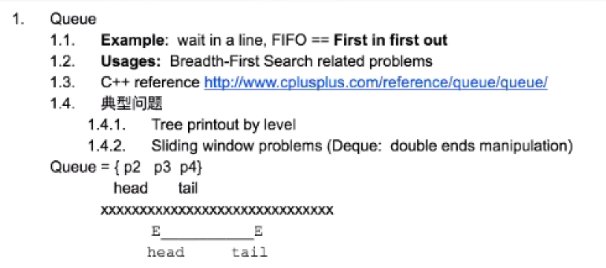
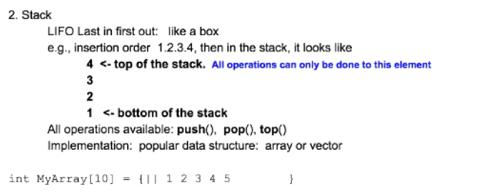

# Table of Contents

### 1. Queue

1). Question1: How to implement queue with stack

**232. Implement Queue using Stacks**
     

Stack1:  to buffer all new elements => push(x) goes to Stack1

Stack2:  to pop out the 1st element

   - Case1:  if stack2 is empty, then we move all the element from stack1 to stack2. Then pop stack2.

   - Case2: if stack2 is not empty , then call stack2.pop()

Time complexity: push => O(1)

pop => O(1)

explain:

1st time call pop(): n (pop from stack1)  + n (push to stack2) + 1 (pop from stack1) = 2n + 1

2nd : 1
.
.
nth: 1

Amortized => average every element = 2n + 1 + (n-1) = 3n / n = 3 => O(1)

### 2. Stack

1). Question2: How to implement the min() function when using stack wiyh O(1)

**Question2: 155. Min Stack**

Stack1 || 1,3,2,4
Stack2:||

