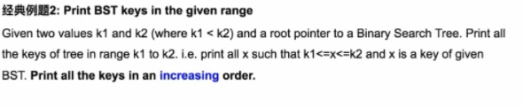
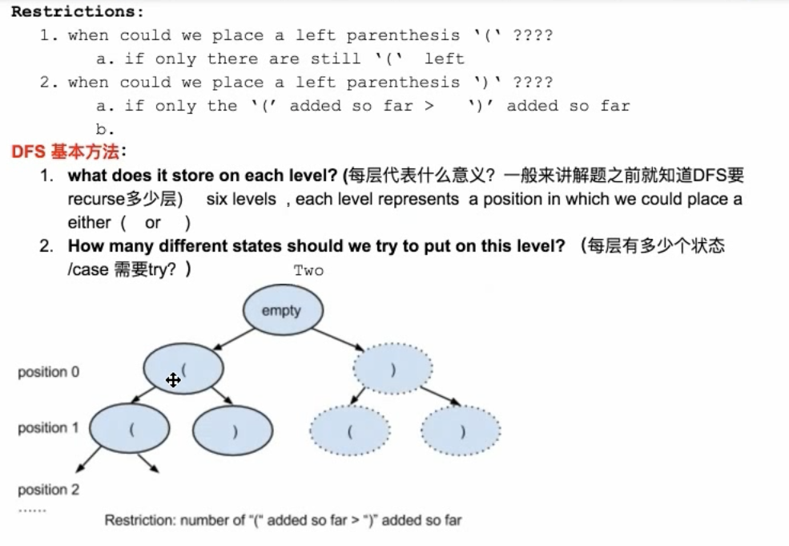

# Table of Contents

## 1. Queue

### 1). Question1: How to implement queue with stack

**232. Implement Queue using Stacks**
     


Stack1:  to buffer all new elements => push(x) goes to Stack1

Stack2:  to pop out the 1st element

   - Case1:  if stack2 is empty, then we move all the element from stack1 to stack2. Then pop stack2.

   - Case2: if stack2 is not empty , then call stack2.pop()


Time complexity: push => O(1)

pop => O(1)

explain:

1st time call pop(): n (pop from stack1)  + n (push to stack2) + 1 (pop from stack1) = 2n + 1

2nd : 1
.
.
nth: 1

Amortized => average every element = 2n + 1 + (n-1) = 3n / n = 3 => O(1)


## 2. Stack
### js 里面用array表示stack.而且没有top, peek, stack[stack.length-1]表示最上面的元素。


### Question2: How to implement the min() function when using stack wiyh O(1)

### 155. Min Stack**

Stack1 || 1,3,2,4
Stack2:||

**Summary:**


## 3. LinkedList


### **Question1: reverse linkedList**

(206.Reverse Linked List, 92.Reverse Linked List II)


### **Question2: find the middle node of a linkedList**

(876.Middle of the Linked List)


### **Question3: check if circle in linkedList**

(141.Linked List Cycle, 142.Linked List Cycle II)


### **Question4: insert a node in linkedList**

(237.Delete Node in a Linked List, 234.Palindrome Linked List)

corner case: head and tail重要（头尾很重要）0， 100


### **Question5: merge two sorted linkedList**

(21.Merge Two Sorted Lists, 56.Merge Intervals, 328.Odd Even Linked List)

### **Question6: convert**

(24.Swap Nodes in Pairs)


### **Question7: reorder**

(_laioffer_ReorderLinkedList)


### **Question8: Partition List**

(86.Partition List)


## 4. Recursion I && Binary Search

### 1). Recursion


=======================================


Call_stack:

Global accessible resource

Usage: store the local information for each recursion function

### 2). Binary Search

### **Question1: Classical version**


### **Question2: How to find an element in the array is closest to target number**


### **Question3: return the first occurrence id an element**


### **Summary**


**Question4: How to find the k elements in the array that is closest to the target number**


## 5. Binary Tree
### 基本知识点：

### 1).Binary-Tree: at most two children node


### 2).pre-order

```javascript
/**
 * 144. Binary Tree Preorder Traversal
 * time : O(n);
 * space : O(n);
 * @param {TreeNode} root
 * @return {number[]}
 */

function TreeNode(val, left, right) {
    this.val = (val === undefined ? 0 : val)
    this.left = (left === undefined ? null : left)
    this.right = (right === undefined ? null : right)
}

// Method1: 这种办法需要传一个数组用来存每一层的内容才可以。
function helper(res, root) {
    if (root == null) return;
    res.push(root.val);
    helper(res,root.left);
    helper(res,root.right);
}

var preorderTraversal = function (root) {
    console.log('root.length',root.length)
    if (root == null || root.length == 0) return [];
    let res = [];
    helper(res,root);
    return res;
};
```
### 3).in-order


### 4).post-order


### Question1: GetHeight of binary tree
111.Minimum Depth of Binary Tree, 104.Maximum Depth of Binary Tree


```javascript
var minDepth = function(root) {
    if (root == null) return 0;
    let left = minDepth(root.left);
    let right = minDepth(root.right);
    if (root.left == null || root.right == null) {
        return Math.max(left,right) + 1;
    }
    return 1 + Math.min(left, right);
};
```

### Question2: How to determine BinaryTree is a Balance BinaryTree
(110.Balanced Binary Tree)


### Question3: How to determine BinaryTree is symmetric
(101.Symmetric Tree
102.Binary Tree Level Order Traversal
107.Binary Tree Level Order Traversal II)


### Question4: Flip Equivalent Binary Trees


951.Flip Equivalent Binary Trees

```
Time: O(n^2)
Space: O(logn)

var flipEquiv = function(root1, root2) {
    if (root1 == null && root2 == null) return true;
    if(root1 == null || root2 == null)  return false;
    if(root1.val != root2.val) return false;

    let flipped = flipEquiv(root1.left, root2.right) && flipEquiv(root1.right, root2.left);
    let regular = flipEquiv(root1.left, root2.left) && flipEquiv(root1.right, root2.right);
    return  flipped || regular;
}
```

## Binary Tree Summary


## 6. Binary Search Tree
### 基本知识点：


### Question1: How to determine BinaryTree is BST


98.Validate Binary Search Tree
```
function isBSTHelper(root, min, max) {
    if (root == null) return true;
    if (root.val >= max || root.val <= min) {
        return false;
    } else {
        return isBSTHelper(root.left, min, root.val) && isBSTHelper(root.right, root.val, max);
    }
}


var isValidBST = function(root) {
    if (root == null) return true;
    return isBSTHelper(root, -Infinity, Infinity)
};
```

### Question2: Print BST keys in the given range

Given two values k1 and k2(k1<k2) and a root pointer to binary search tree. Find all the keys of tree in range k1 and k2.
Print all the keys in an increasing order.



938.Range Sum of BST
```
var printRangeBST = function (root, k1, k2) {
    if (root == null) return null;
    // 这里不需要等号，等于的话，左边就一定比k1小了。
    if (root.val > k1) {
        printRangeBST(root.left, k1,k2);
    }
    if (root.val >= k1 && root.val <= k2) {
        console.log(root.val);
    }
    if (root.val < k2) {
        printRangeBST(root.right, k1,k2);
    }
};
```

## 7. Graph Search - BFS
### 基本知识点：
heap : complete binary tree.except the last level and as far as left side.


    1.insert: 不停的跟父元素看,一层一层往上走。时间复杂度是树的层数。
    
    2.update： 变小就只要往上看。变大就往下看，然后跟左右两个孩子，跟小的那个孩子来换。
    
    3.get/top: index == 0
    
    4.pop: 最顶端的没有了。就把最尾部的元素放上去。 index= arr.lenght - 1, 然后按照update来做。


### Question1: K smallest in unsorted array
215. Kth Largest Element in an Array

V8 is Google's JavaScript engine. So the V8 engine uses Insertion Sort for super short arrays and Quick Sort for longer arrays. Interesting.

**QuickSort => Time: O(nlog(n)).Space: O(log(n)).**

**InsertionSort(default) => Time : O(n^2). Space: O(1)**

```javascript
/**
 * /**
 * 215. Kth Largest Element in an Array
 * 最坏：O(n^2) 平均：O(nlogn) =》 n to the power 2
 * space : O(1)
 * @param {number[]} nums
 * @param {number} k
 * @return {number}
 */
var findKthLargest = function(nums, k) {
    nums = nums.sort((a,b) => a-b);
    return nums[nums.length - k];
};

console.log(findKthLargest([3,2,3,1,2,4,5,5,6], 3));
```

### BFS-1：
### Question2: Get keys in binary tree layer by layer


102.Binary Tree Level Order Traversal

```javascript
/**
 * Q102:Given the root of a binary tree, return the level order traversal of its nodes' values. (i.e., from left to right, level by level).
 * Input: root = [3,9,20,null,null,15,7]
 * Output: [[3],[9,20],[15,7]]
 * Definition for a binary tree node.
 * function TreeNode(val, left, right) {
 *     this.val = (val===undefined ? 0 : val)
 *     this.left = (left===undefined ? null : left)
 *     this.right = (right===undefined ? null : right)
 * }
 */
/**
 * @param {TreeNode} root
 * @return {number[][]}
 */
var levelOrder = function (root) {
    if(!root) return [];
    let res = [];
    let queue = [root];
    while (queue.length) {
        let size = queue.length;
        let list = [];
        for (let i = 0; i < size; i++) {
            let cur = queue.shift(); // pick up first element from array
            if (cur.left != null) queue.push(cur.left);
            if (cur.right != null) queue.push(cur.right);
            list.push(cur.val);
        }
        res.push(list);
    }
    return res;
};
```
### Question3: Bipartite

785.Is Graph Bipartite?


```javascript
/**
 * @param {number[][]} graph
 * @return {boolean}
 */
var isBipartite = function (graph) {
    const n = graph.length;
    const visited = Array(n).fill(0);

    for (let i = 0; i < n; i++) {
        if (visited[i] == 0) {
            let queue = [i];
            visited[i] = 1;
            while (queue.length) {
                const curr = queue.shift();
                for (let nei of graph[curr]) {
                    if (visited[nei] === visited[curr]) {
                        return false;
                    }
                    if (visited[nei] == 0) {
                        visited[nei] = -visited[curr];
                        queue.push(nei);
                    }
                }
            }
        }
    }
    return true;
};
```

### Question4: If binary tree is complete


958.Check Completeness of a Binary Tree

```javascript
/**
 * Definition for a binary tree node.
 * function TreeNode(val, left, right) {
 *     this.val = (val===undefined ? 0 : val)
 *     this.left = (left===undefined ? null : left)
 *     this.right = (right===undefined ? null : right)
 * }
 */
/**
 * @param {TreeNode} root
 * @return {boolean}
 */
function TreeNode(val, left, right) {
    this.val = (val === undefined ? 0 : val)
    this.left = (left === undefined ? null : left)
    this.right = (right === undefined ? null : right)
}
// Method 1
var isCompleteTree = function (root) {
    if (root == null) return false;
    let queue = [root];
    // 加上这一行就不对了,要非常注意。
    // let size = queue.length;
    let flag = false;
    while (queue.length) {
        let cur = queue.shift();
        // case 1: 左边为空，右边不为空。肯定不对
        if (cur.left == null && cur.right != null) return false;
        // case 2: 左边不是空，右边是空。先判断flag, 然后判断要是还有新的node就不对。在push.
        if (cur.left != null && cur.right == null) {
            if (flag == true) {
                return false;
            }
            queue.push(cur.left);
            flag = true;
        }
        // case 3: 同时都为空，就把flag给改了。
        if (cur.left == null && cur.right == null) {
            flag = true;
        }
        // case 4: 同时都不是空，先判断flag,在push.
        if (cur.left != null && cur.right != null) {
            if (flag == true) {
                return false;
            }
            queue.push(cur.left);
            queue.push(cur.right);
        }
    }
    return true;
};

// Method 2:  T.C: O(N)， S.C: O(N)
// 这种情况比较特殊。就是一直push.直到出现null。stop。如果还有node && node != null。就不对。
var isCompleteTree2 = function(root) {
    let queue = [];
    queue.push(root);
    while (queue.length) {
        let cur = queue.shift();
        if (cur == null) {
            break;
        }
        queue.push(cur.left);
        queue.push(cur.right);
    }

    while (queue.length) {
        let cur = queue.shift();
        if (cur != null) {
            return false;
        }
    }
    return true;
};
```


### BFS-2

BFS-1: 中心扩散 => Queue => 谁先进去谁先出来。

BFS-2: 值越小越先出来 => priorityQueue => 进去的顺序没有区别，谁小就把谁弹出来。

### Question5: Kth smallest number in sorted matrix

378.Kth Smallest Element in a Sorted Matrix


```javascript
/**
 * 378. Kth Smallest Element in a Sorted Matrix
 * Given an n x n matrix where each of the rows and columns are sorted in ascending order, return the kth smallest element in the matrix.
 * Note that it is the kth smallest element in the sorted order, not the kth distinct element.
 * Input: matrix = [[1,5,9],[10,11,13],[12,13,15]], k = 8
 * Output: 13
 * Explanation: The elements in the matrix are [1,5,9,10,11,12,13,13,15], and the 8th smallest number is 13
 * @param {number[][]} matrix
 * @param {number} k
 * @return {number}
 */
// Method 1:
var kthSmallest = function (matrix, k) {
    return matrix.flatMap(x => x).sort((a, b) => a - b)[k - 1]
};
let matrix = [[1,5,9],[10,11,13],[12,13,15]]
console.log(kthSmallest(matrix, 8))


// Method 2:
var singleArray = function(arr) {
    let size = arr.length;
    let oneDarray = [];
    for(let i = 0; i< size; i++) {
        oneDarray.push(...arr[i]);
    }
    return oneDarray;
}
```

## 7. Graph Search - DFS

DFS =>Back-tracking is just a behavior

binary tree: 叶子结点的个数决定整个树的node个数。

exponential 增长。

如果你不清楚，dfs能扎进去多深，也是不行的。


Tree pre-order 遍历


### Question1: Print all subset

78.Subsets


```javascript
/* 78. Subsets
* Given a set of distinct integers, nums, return all possible subsets.

    Note: The solution set must not contain duplicate subsets.

    For example,
    If nums = [1,2,3], a solution is:
    [
        [3],
        [1],
        [2],
        [1,2,3],
        [1,3],
        [2,3],
        [1,2],
        []
    ]

test : [1,2,3]

    []
    [1]
    [1, 2]
    [1, 2, 3]
    [1, 3]
    [2]
    [2, 3]
    [3]

1 — 2 - 3
|   |
2   3
|
3


time : O(2^n);
space : O(n);
*/
// method 1
// 这种解法在一开始就把东西加进去了。 for 循环`i = start`这个表示start在哪一层。

/**
 * @param {number[]} nums
 * @return {number[][]}
 */
function subsets(nums) {
    let list = [];
    if(nums == null || nums.length == 0) return res;
    helper(list, [], nums, 0);
    return list;
}

function helper(list , tempList, nums, start) {
    list.push([...tempList]); // 初始情况，一开始就是把空加了进去。
    for(let i = start; i < nums.length; i++) {
        tempList.push(nums[i]);                   // choose
        helper(list, tempList, nums, i + 1);   // explore
        tempList.pop();                           // unchoose
    }
}

// method 2
function subsetsI(nums) {
    const result = [[]];
    for (const num of nums) {
        result.push(...result.map(x => [...x, num]));
    }
    return result;
};
```


### Question2: Print all valid permutation parenthesis




20.Valid Parentheses
```javascript
  /**
 * 20. Valid Parentheses
 * Given a string containing just the characters '(', ')', '{', '}', '[' and ']', determine if the input string is valid.

 The brackets must close in the correct order, "()" and "()[]{}" are all valid but "(]" and "([)]" are not.

 case1 : ()[]{}
 stack :

 case2 : ([)]
 stack :

 case3 : }
 stack :

 time : O(n);
 space : O(n);
 * @param s
 * @return
 */
var isValid = function(s) {
    let stack = []
    
    let map = {
        '(' : ')',
        '[' : ']',
        '{' : '}'
    }
    
    for(let i = 0; i < s.length; i++) {
        if(map[s[i]]) {
            stack.push(map[s[i]])
        } else {
            if(s[i] !== stack.pop()) return false
        }
    }
    
    return stack.length === 0
};
```

22.Generate Parentheses
```javascript
/**
 * 22. Generate Parentheses
 * Given n pairs of parentheses, write a function to generate all combinations of well-formed parentheses.

 For example, given n = 3, a solution set is:
 [
 "((()))",
 "(()())",
 "(())()",
 "()(())",
 "()()()"
 ]


 time : O(n!) (2^n)
 space : O(n)

 卡特兰数：
 (0,n-1) (1,n-2) (2,n-3) ... (n-1,0)

 * @param {number} n
 * @return {string[]}
 */
function helper (n, s, left, right, res) {
    if (s.length == 2*n) {
        res.push(s);
    }

    if (left < n) {
        helper(n,s+'(',left+1, right, res);
    }

    if (left > right) {
        helper(n, s+')',left, right+1, res);
    }
}

var generateParenthesis = function(n) {
    let res = [];
    helper(n,'',0,0, res);
    return res;
};
```

### Question3: Print all combinations of coins that can sum up to total value k.

322.Coin Change - DP


```javascript
var coinChange = function(coins, amount) {
    //dp[i] the fewest number of coins to make up i
    var dp = Array(amount + 1).fill(amount+1);
    //we can only use 0 coin to make up 0 amount
    dp[0] = 0;
    for(var i = 1; i <= amount; i++) {
        for(var coin of coins) {
            if(coin <= i) dp[i] = Math.min(dp[i], dp[i - coin] + 1);
        }
    }
    return dp[amount] < amount+1 ? dp[amount] : -1;
};
```

### Question4: Given a string with no duplicated letters, how to print all permutations of the string.

46.Permutations

47.Permutations II