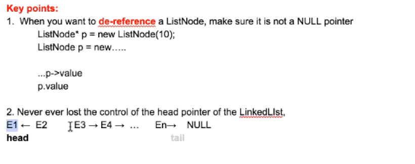
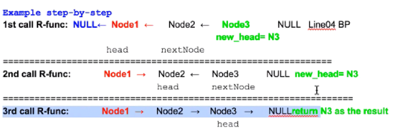

# Table of Contents

### 1. Queue

1). Question1: How to implement queue with stack

**232. Implement Queue using Stacks**
     

Stack1:  to buffer all new elements => push(x) goes to Stack1

Stack2:  to pop out the 1st element

   - Case1:  if stack2 is empty, then we move all the element from stack1 to stack2. Then pop stack2.

   - Case2: if stack2 is not empty , then call stack2.pop()

Time complexity: push => O(1)

pop => O(1)

explain:

1st time call pop(): n (pop from stack1)  + n (push to stack2) + 1 (pop from stack1) = 2n + 1

2nd : 1
.
.
nth: 1

Amortized => average every element = 2n + 1 + (n-1) = 3n / n = 3 => O(1)

### 2. Stack
js 里面用array表示stack.而且没有top, peek, stack[stack.length-1]表示最上面的元素。

1). Question2: How to implement the min() function when using stack wiyh O(1)

**Question2: 155. Min Stack**

Stack1 || 1,3,2,4
Stack2:||

**Summary:**

### 3. LinkedList

**Question1: reverse linkedList**

(206.Reverse Linked List, 92.Reverse Linked List II)

**Question2: find the middle node of a linkedList**

(876.Middle of the Linked List)

**Question3: check if circle in linkedList**

(141.Linked List Cycle, 142.Linked List Cycle II)

**Question4: insert a node in linkedList**

(237.Delete Node in a Linked List, 234.Palindrome Linked List)

corner case: head and tail重要（头尾很重要）0， 100

**Question5: merge two sorted linkedList**

(21.Merge Two Sorted Lists, 56.Merge Intervals, 328.Odd Even Linked List)

**Question6: convert**

(24.Swap Nodes in Pairs)

**Question7: reorder**

(_laioffer_ReorderLinkedList)

**Question8: Partition List**

(86.Partition List)

### 4. Recursion I && Binary Search

1). Recursion

=======================================

Call_stack:

Global accessible resource

Usage: store the local information for each recursion function

2). Binary Search

**Question1: Classical version**

**Question2: How to find an element in the array is closest to target number**

**Question3: return the first occurrence id an element**

**Summary**

**Question4: How to find the k elements in the array that is closest to the target number**

