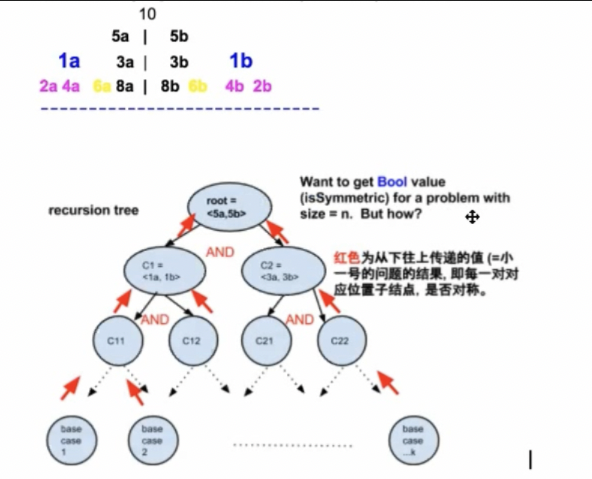

# Table of Contents

## 1. Queue

### 1). Question1: How to implement queue with stack

**232. Implement Queue using Stacks**
     


Stack1:  to buffer all new elements => push(x) goes to Stack1

Stack2:  to pop out the 1st element

   - Case1:  if stack2 is empty, then we move all the element from stack1 to stack2. Then pop stack2.

   - Case2: if stack2 is not empty , then call stack2.pop()


Time complexity: push => O(1)

pop => O(1)

explain:

1st time call pop(): n (pop from stack1)  + n (push to stack2) + 1 (pop from stack1) = 2n + 1

2nd : 1
.
.
nth: 1

Amortized => average every element = 2n + 1 + (n-1) = 3n / n = 3 => O(1)


## 2. Stack
### js 里面用array表示stack.而且没有top, peek, stack[stack.length-1]表示最上面的元素。


### Question2: How to implement the min() function when using stack wiyh O(1)

### 155. Min Stack**

Stack1 || 1,3,2,4
Stack2:||

**Summary:**


## 3. LinkedList


### **Question1: reverse linkedList**

(206.Reverse Linked List, 92.Reverse Linked List II)


### **Question2: find the middle node of a linkedList**

(876.Middle of the Linked List)


### **Question3: check if circle in linkedList**

(141.Linked List Cycle, 142.Linked List Cycle II)


### **Question4: insert a node in linkedList**

(237.Delete Node in a Linked List, 234.Palindrome Linked List)

corner case: head and tail重要（头尾很重要）0， 100


### **Question5: merge two sorted linkedList**

(21.Merge Two Sorted Lists, 56.Merge Intervals, 328.Odd Even Linked List)

### **Question6: convert**

(24.Swap Nodes in Pairs)


### **Question7: reorder**

(_laioffer_ReorderLinkedList)


### **Question8: Partition List**

(86.Partition List)


## 4. Recursion I && Binary Search

### 1). Recursion


=======================================


Call_stack:

Global accessible resource

Usage: store the local information for each recursion function

### 2). Binary Search

### **Question1: Classical version**


### **Question2: How to find an element in the array is closest to target number**


### **Question3: return the first occurrence id an element**


### **Summary**


**Question4: How to find the k elements in the array that is closest to the target number**


## 5. Binary Tree
### 基本知识点：

### 1).Binary-Tree: at most two children node


### 2).pre-order

```javascript
/**
 * 144. Binary Tree Preorder Traversal
 * time : O(n);
 * space : O(n);
 * @param {TreeNode} root
 * @return {number[]}
 */

function TreeNode(val, left, right) {
    this.val = (val === undefined ? 0 : val)
    this.left = (left === undefined ? null : left)
    this.right = (right === undefined ? null : right)
}

// Method1: 这种办法需要传一个数组用来存每一层的内容才可以。
function helper(res, root) {
    if (root == null) return;
    res.push(root.val);
    helper(res,root.left);
    helper(res,root.right);
}

var preorderTraversal = function (root) {
    console.log('root.length',root.length)
    if (root == null || root.length == 0) return [];
    let res = [];
    helper(res,root);
    return res;
};
```
### 3).in-order


### 4).post-order


## Question1: GetHeight of binary tree
111.Minimum Depth of Binary Tree, 104.Maximum Depth of Binary Tree


```javascript
var minDepth = function(root) {
    if (root == null) return 0;
    let left = minDepth(root.left);
    let right = minDepth(root.right);
    if (root.left == null || root.right == null) {
        return Math.max(left,right) + 1;
    }
    return 1 + Math.min(left, right);
};
```

## Question2: How to determine BinaryTree is a Balance BinaryTree
(110.Balanced Binary Tree)


## Question3: How to determine BinaryTree is symmetric
(101.Symmetric Tree
102.Binary Tree Level Order Traversal
107.Binary Tree Level Order Traversal II)



## Question4: Flip Equivalent Binary Trees


951.Flip Equivalent Binary Trees

```
Time: O(n^2)
Space: O(logn)

var flipEquiv = function(root1, root2) {
    if (root1 == null && root2 == null) return true;
    if(root1 == null || root2 == null)  return false;
    if(root1.val != root2.val) return false;

    let flipped = flipEquiv(root1.left, root2.right) && flipEquiv(root1.right, root2.left);
    let regular = flipEquiv(root1.left, root2.left) && flipEquiv(root1.right, root2.right);
    return  flipped || regular;
}
```

## Binary Tree Summary


## 6. Binary Search Tree
### 基本知识点：


### Question1: How to determine BinaryTree is BST


98.Validate Binary Search Tree
```
function isBSTHelper(root, min, max) {
    if (root == null) return true;
    if (root.val >= max || root.val <= min) {
        return false;
    } else {
        return isBSTHelper(root.left, min, root.val) && isBSTHelper(root.right, root.val, max);
    }
}


var isValidBST = function(root) {
    if (root == null) return true;
    return isBSTHelper(root, -Infinity, Infinity)
};
```

### Question2: Print BST keys in the given range

Given two values k1 and k2(k1<k2) and a root pointer to binary search tree. Find all the keys of tree in range k1 and k2.
Print all the keys in an increasing order.


938.Range Sum of BST
```
var printRangeBST = function (root, k1, k2) {
    if (root == null) return null;
    // 这里不需要等号，等于的话，左边就一定比k1小了。
    if (root.val > k1) {
        printRangeBST(root.left, k1,k2);
    }
    if (root.val >= k1 && root.val <= k2) {
        console.log(root.val);
    }
    if (root.val < k2) {
        printRangeBST(root.right, k1,k2);
    }
};
```